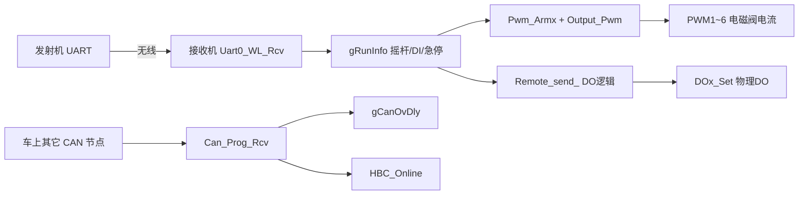

# 恢复记忆

- Transcript id: `2a31a620-e3c1-4242-a5de-4bb37bce75d2`
- Exported at: `2026-05-27T11:49:27`
- Local source: `C:\Users\DELL\.cursor\projects\empty-window\agent-transcripts\2a31a620-e3c1-4242-a5de-4bb37bce75d2\2a31a620-e3c1-4242-a5de-4bb37bce75d2.jsonl`
- Cursor relative path: `projects/empty-window/agent-transcripts/2a31a620-e3c1-4242-a5de-4bb37bce75d2/2a31a620-e3c1-4242-a5de-4bb37bce75d2.jsonl`

## Transcript

### user

```text
<user_query>
恢复记忆
</user_query>
```

### assistant

```text
正在按“恢复记忆”流程加载记忆文件。

[REDACTED]
```

### assistant

```text
**记忆已恢复。** 已按手册 §7 完成读取，可继续工作。

## 已读取清单

| 序号 | 文件 | 状态 |
|------|------|------|
| 1 | `C:\Users\DELL\.cursor\memory\CURSOR_AGENT_MEMORY.md` | ✅ 整合记忆与导航 |
| 2 | `C:\Users\DELL\.claude\projects\C--Users-DELL\memory\编程手册与纪律.md` | ✅ 编程纪律（权威） |
| 3 | `C:\Users\DELL\.claude\projects\C--Users-DELL\memory\MEMORY.md` | ✅ 项目/参考/反馈索引 |

当前未指定具体任务，因此**未**展开 `project_*` / `reference_*` / `feedback_*` 详情；接到任务后会按索引按需读取。

---

## 核心纪律（已载入）

1. **改前必备份**，禁止擅自改编码，不能把程序弄丢  
2. **GBK/GB2312 的 C 源**：禁用 Edit 硬改，用 Python 按字节 `decode/encode('gbk')`  
3. **改 C 函数**：三步锁定（函数头 + 结束 `}` + 不越界），改后检查下一函数  
4. **硬件/协议**：零马虎，文档须基于实际代码，先读代码再验证  
5. **嵌入式风格**：简单变量、可 Keil 全局搜索、跟你的命名习惯  
6. **工作方式**：遇阻自救、追根溯源（勿凭函数名猜周期）、诚实、改后验证  
7. **先理解再动手**：输出理解要点，你确认后再写代码；**最小改动**

---

## 项目记忆索引（待命）

- **QDN / 全电脑模型**：全电脑、标定策略、工作场景、视觉架构/决策/内参、`T_shell_cam`  
- **MC_LCD / 7Control_V1.2**：框架、正解、标定、HMI  
- **200A 屏**、**炮孔图**、**C 除锈机器人 LCD**  
- **参考**：200A 接口、McgsPro MCP、CAN ID 命名  
- **反馈**：备份、GBK、大括号、BF/WL、协议、真诚、硬件严谨等  

**OpenCV / QDN 视觉**：优先 `qdn-project-vision`，再 `opencv` / `terminalskills-opencv`；GBK/嵌入式仍走 `embedded-c-safe-edit` / `safe-edit-gbk`。

---

## 技能入口

- Claude：`C:\Users\DELL\.claude\skills`（`backup-and-edit`、`embedded-c-safe-edit`、`safe-edit-gbk` 等）  
- Cursor：`C:\Users\DELL\.cursor\skills`、`skills-cursor`  
- Codex：`C:\Users\DELL\.codex\skills`（含 Keil5、OpenCV）

---

可以说一下接下来要做哪块（例如 QDN 视觉、200A 屏、除锈机器人 LCD、Keil 工程），我会按索引加载对应 `project_*` / `feedback_*` 并开始执行。

[REDACTED]
```

### user

```text
<user_query>
F:\工作\AI模型\M美联电解铝场合\碳刷摇杆的接收机程序  分析下这个程序。然后看看为什么发射机都没有上电。接收机有输出。
</user_query>
```

### assistant

```text
正在分析该接收机程序，并排查发射机未上电时接收机仍有输出的原因。

[REDACTED]
```

### assistant

```text
[REDACTED]
```

### assistant

```text
## 程序概览

工程路径：`F:\工作\AI模型\M美联电解铝场合\碳刷摇杆的接收机程序\kx106model_V1.042（现场调试版本）`

| 项目 | 说明 |
|------|------|
| MCU | NXP LPC17xx |
| 工程名 | `KX_BC_RCV`（碳刷接收机） |
| 通信 | UART0 无线（帧头 `5A A5` + 校验）+ CAN |
| 主循环 | `main.c`：1ms 定时任务 + 主循环处理 UART/CAN/IO |

**主数据流：**



---

## 发射机未上电，接收机仍有输出的原因

按可能性从高到低说明。

### 1. 核心逻辑缺陷：`gCanOvDly` 挡住了无线失联保护（最可能）

1ms 任务里决定走“急停清零”还是“正常 PWM”：

```267:277:F:\工作\AI模型\M美联电解铝场合\碳刷摇杆的接收机程序\kx106model_V1.042（现场调试版本)\Src\main.c
			if(((gRunInfo.vYKJiTing==0x55 ) || bE_STOP_ || (((gCommOvDly > 1000)|| (gWLRcvOkN<3))&&(gCanOvDly==0))  || (gYKbHorn==0)) && HBC_Online ==0 )
			{
				//app_DOClr();
					App_JiTing();  
				 
				
			}
			else
			{
				if(vPwmcyc >= 25)
					App_PWM();
			}
```

要点：

- 无线超时条件：`(gCommOvDly > 1000 || gWLRcvOkN < 3) **且** gCanOvDly == 0`
- `gCommOvDly` 每 ms 自增（`timer.c`），发射机不上电会一直涨
- 但 **`gCanOvDly != 0` 时，即使发射机完全失联，也不会进 `App_JiTing()`**，仍走 `App_PWM()`

`gCanOvDly` 在收到特定 CAN 帧时被置为 1000ms：

```1280:1323:F:\工作\AI模型\M美联电解铝场合\碳刷摇杆的接收机程序\kx106model_V1.042（现场调试版本)\Src\CanOpen.c
		gCanOvDly = _TXC_OV_DLY;
	}
	// ...
		gCanOvDly = _TXC_OV_DLY;
```

对应 ID 包括 `0x18374840`、`0x18374841` 等（注释为 Mob3/其它控制器）。**车上只要有其它 CAN 设备在发这些帧，接收机就会一直认为“CAN 在线”，无线失联保护被旁路。**

现场表现：发射机断电，但发动机 ECU、显示屏、其它控制器仍在 CAN 上 → 接收机继续按旧摇杆数据或默认逻辑输出 PWM/DO。

---

### 2. `HBC_Online == 1` 时，整套无线安全被跳过

收到 `0x18FEE900` 后：

```1540:1547:F:\工作\AI模型\M美联电解铝场合\碳刷摇杆的接收机程序\kx106model_V1.042（现场调试版本)\Src\CanOpen.c
				HBC_Online = 1 ;
				HBC_DLY = 1000 ;
	 	

	}
 	if (HBC_DLY==0)
	{
		 HBC_Online = 0 ;
	}
```

`main.c` 里安全判断要求 `HBC_Online == 0` 才进 `App_JiTing()`。若现场有 HBC/其它节点周期性发该帧，**发射机断电也不会触发无线失联停机**。

---

### 3. DO 默认就是“有输出”（常被误认为“系统在动”）

`DO_H06` 默认 1，非急停时 `Remote_send_()` 也保持为 1：

```169:169:F:\工作\AI模型\M美联电解铝场合\碳刷摇杆的接收机程序\kx106model_V1.042（现场调试版本)\Src\App_usr.c
unsigned char DO_H06   =1 ; 
```

```1946:1956:F:\工作\AI模型\M美联电解铝场合\碳刷摇杆的接收机程序\kx106model_V1.042（现场调试版本)\Src\App_usr.c
		if ( gRunInfo.vYKJiTing == 0x55   )
		{
		
			 DO_H04 =1 ;
			 DO_H06 =0 ;
		}
		else
		{
			 DO_H04 =0 ;
			   DO_H06 =1 ;
		}
```

上电还直接：

```105:105:F:\工作\AI模型\M美联电解铝场合\碳刷摇杆的接收机程序\kx106model_V1.042（现场调试版本)\Src\main.c
		DOx_Set(4, 1);	
```

因此：**发射机未上电，只要没进急停字节 `0x55`，DO4（对应 `DO_H06`）就会一直为高。** 这属于程序设计，不是发射机在发数据。

`App_JiTing()` 只清零 PWM，**不会**把 `DO_H06` 拉低；`Remote_send_()` 在主循环里仍会把它置 1。

---

### 4. 上电瞬间 PWM 通道被强制打开

```90:97:F:\工作\AI模型\M美联电解铝场合\碳刷摇杆的接收机程序\kx106model_V1.042（现场调试版本)\Src\main.c
	PWM_Init(1,100);
	PWM_Start(1);
				PWM1_A;
				PWM2_A;
				PWM3_A;
				PWM4_A;
				PWM5_A;
				PWM6_A;
```

`ValInit()` 还把 `gPWMx[i].vmA` 初值设为 10（非零小电流）。上电后、失联保护生效前，PWM 可能有微弱输出。

---

### 5. 碳刷算法：非中位时带最小电流偏置

`Pwm_Armx()` 里 E1~E4 爬坡输出带 `E_MIN_PWM`（约 280）：

```1238:1240:F:\工作\AI模型\M美联电解铝场合\碳刷摇杆的接收机程序\kx106model_V1.042（现场调试版本)\Src\App_usr.c
 	 E3_ramp_OUT= vPwm_Buf_E3* E3_Enabel_flags  +E3_MIN_PWM * E3_Enabel_flags 
								 + 	( Move_buf==4 )* E3_pwm_addr1   
```

若 `gRunInfo.vArm[]` 仍保留上次有效帧的数值（发射机断电前推过摇杆），且走了 `App_PWM()`，**会有约 280 量级的 PWM 底电流**，看起来像“没发射也在动”。

---

### 6. 串口噪声偶发“假在线”

`Uart0_WL_Rcv()` 用 XOR + 累加和校验；总线上有噪声时，偶发凑出合法帧会：

- `gCommOvDly = 0`（重置超时）
- `gWLRcvOkN` 在 1s 周期内累加

这会推迟失联判断，但通常不如第 1、2 条影响大。

---

### 7. `JKMB_offline` 未真正参与保护

`JKMB_offline` 只在收到 CAN `0x1A4` 时被清零，**未见超时置位逻辑**，也未在 `main` 的 PWM 分支使用，属于无效离线标志。

---

## 现场快速核对（建议按顺序）

| 观测项 | 含义 |
|--------|------|
| CAN 上读 `gCanOvDly`（程序里经 `0x318/0x319` 等上报） | 若长期 >0，说明被其它 CAN 帧刷新，无线失联保护不会动作 |
| CAN 上 `HBC_Online` | 为 1 时完全不走 `App_JiTing` |
| 仅 DO 有输出、PWM 为 0 | 多半是 `DO_H06=1` 默认逻辑，不是发射机在控 |
| PWM 有小电流 | 查 `gCommOvDly`、`gWLRcvOkN`，以及 `gRunInfo.vArm[]` 是否停在非 127 |
| 发射机断电 + 整车 CAN 全部断开 | 若此时输出消失，可确认是 **CAN 旁路导致** |

---

## 结论（一句话）

**程序没有把“发射机无线在线”作为输出的唯一条件**；实际条件是：未急停、且 `(无线超时 && CAN总线空闲) || HBC在线` 等组合不满足时才停输出。现场车上 CAN 仍有其它节点、或 DO 默认为高时，**发射机不上电接收机仍会有 DO/PWM 输出，这是当前代码逻辑的结果，不是偶然硬件故障。**

---

## 若需改程序（方向供你确认）

1. 无线失联判断去掉 `&& (gCanOvDly==0)`，或改为：**仅当近期收到合法无线帧才允许 `App_PWM()`**  
2. `HBC_Online` 不应绕过无线失联；至多接管摇杆数据源，不能取消 fail-safe  
3. 发射机失联时：`App_JiTing()` 同时拉低 `DO_H06` 等所有动作 DO  
4. 上电默认 `DO_H06=0`，PWM 通道先 `OFF` 再等待首帧有效无线数据  

你现场看到的“输出”具体是 **哪一路 DO** 还是 **哪几路 PWM 电流**？说一下我可以对照 `Pwm_Armx` / `DI_DO_define` 帮你定位到具体引脚和变量。若要改代码，确认后我可以按 GBK 安全流程出补丁。

[REDACTED]
```
