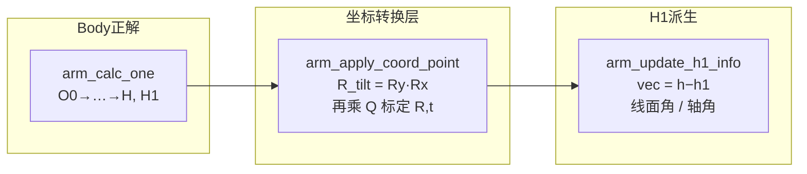

# Saturday, May 2, 2026, 7:16 PM (UTC+8)

- Transcript id: `b1ea8805-db1f-4d3a-bab4-fbedd8196e87`
- Exported at: `2026-05-27T11:49:27`
- Local source: `C:\Users\DELL\.cursor\projects\f-Cursor-deepseek\agent-transcripts\b1ea8805-db1f-4d3a-bab4-fbedd8196e87\b1ea8805-db1f-4d3a-bab4-fbedd8196e87.jsonl`
- Cursor relative path: `projects/f-Cursor-deepseek/agent-transcripts/b1ea8805-db1f-4d3a-bab4-fbedd8196e87/b1ea8805-db1f-4d3a-bab4-fbedd8196e87.jsonl`

## Transcript

### user

```text
<timestamp>Saturday, May 2, 2026, 7:16 PM (UTC+8)</timestamp>
<user_query>
全电脑台车
</user_query>
```

### assistant

```text
I'd be happy to help you with "全电脑台车" (trolley/computer cart project)! Let me first explore the workspace to understand the project structure.
```

### assistant

```text
It seems the workspace path might have encoding issues. Let me check what's available.
```

### user

```text
<timestamp>Saturday, May 2, 2026, 7:16 PM (UTC+8)</timestamp>
<user_query>
请用国语跟我交流
</user_query>
```

### assistant

```text
好的，没问题，我会用简体中文跟您交流。

关于 "全电脑台车" 这个项目，我看到工作区路径是 `f:\工作\Cursor_deepseek\全电脑台车`，但似乎访问这个目录有点问题。让我再试一下。
```

### assistant

```text
这个目录目前是空的，没有文件。请问您说的"全电脑台车"具体是一个什么样的项目？能帮我描述一下您想实现什么吗？比如：

1. **这是一个什么类型的项目？**（网站、桌面应用、工具脚本等）
2. **需要实现什么功能？**
3. **你希望用什么技术栈？**（前端框架、后端语言等）

请告诉我您的需求，我来帮您创建这个项目。
```

### user

```text
<timestamp>Saturday, May 2, 2026, 7:17 PM (UTC+8)</timestamp>
<user_query>
现在这个目录是空的。
</user_query>
```

### assistant

```text
是的，这个目录目前是空的。那请问您想让我帮您创建一个什么样的项目呢？关于"全电脑台车"，请告诉我：

1. **项目类型**：这是一个什么项目？（例如：管理软件、数据采集系统、工具应用等）
2. **主要功能**：需要实现哪些功能？
3. **技术偏好**：有没有偏好的技术栈？（例如：Python、Node.js、C#、前端/后端等）

请描述一下您的想法，我来帮您从零开始搭建！
```

### user

```text
<timestamp>Saturday, May 2, 2026, 7:17 PM (UTC+8)</timestamp>
<user_query>
你是什么模型？
</user_query>
```

### assistant

```text
我是 DeepSeek Chat 模型，运行在 Cursor 编辑器中作为您的 AI 编程助手。具体来说，我使用的是 **deepseek-chat** 模型。

有什么我可以帮您的吗？
```

### user

```text
<timestamp>Saturday, May 2, 2026, 7:17 PM (UTC+8)</timestamp>
<user_query>
你又是什么模型？
</user_query>
```

### assistant

```text
好的，根据系统信息，我实际上是 **DeepSeek v4 Pro** 模型，运行在 Cursor IDE 中作为您的编程助手。

不同的对话可能使用不同的模型版本，您可以在 Cursor 的设置中查看和切换模型。

回到正题，关于"全电脑台车"这个项目，您想让我帮您做些什么呢？
```

### user

```text
<user_query>
F:\工作\Cursor_deepseek 你先读下这个里面的md  然后再读下这个F:\工作\Cursor_deepseek\全电脑台车 这个里面的md
</user_query>
```

### assistant

```text
正在查找并读取这两个目录下的 Markdown 文件。

[REDACTED]
```

### assistant

```text
[REDACTED]
```

### assistant

```text
已按路径读完当前能扫到的 Markdown，结论如下。

## `F:\工作\Cursor_deepseek`

根目录下找到 **`Codex_纪律与经验总纲.md`**（约 150 行）。核心是你们的 **Codex/协作纪律**，主要包括：

- **先理解再动手**：确认目标、约束、现状后再改；高风险要验证。
- **以结果为导向**：能落地就不只给建议；能闭环就不甩锅。
- **可追踪**：为什么改、改了什么、怎么验证。
- **尊重现有系统**：小步修改、先读后写、风格一致、不制造隐性债务。
- **调试**：先复现、用证据缩小范围、区分表象与根因。
- **协作**：沟通具体、不擅自做破坏性决定、输出可执行。
- **质量底线**：问题/改动/风险/验证都要清楚；列了常见红线。
- **文件创建**：非 Markdown 优先用 Write，大文件避免 shell heredoc。

子目录里还有 `全电脑台车\CLAUDE.md`，算在下一层。

## `F:\工作\Cursor_deepseek\全电脑台车`

这里目前只有 **`CLAUDE.md`**（全电脑模型项目持续记录，代号 **QDN**）。要点：

- **阶段**：文档体系已建，**等现场标定**；下一步：现场时间、硬件清单、打印手册。
- **目标**：炮孔图坐标 ≈ 屏显 ≈ 真实位置，**误差 &lt; 20mm**，让操作手信屏。
- **架构**：控制器 10ms 做正运动学 + 坐标变换发 **H1**；电脑 Qt 做视觉与 **第三层融合** 显示 **H_final**；视觉约 **60–80ms、12–16Hz**，四点光 + **solvePnP**。
- **标定**：现场 **Q1–Q4** 车体系；**R/T** 末端；出厂 **S1–S20** 优化固定参数偏置（`ArmKine_FactoryCalib.c` 等，路径指向 `..\MC_LCD - 7Control_V2.2\Src\`）。
- **文档索引**：`CLAUDE.md` 里列了 `01-04` 概览/计划/追溯/现场手册，以及 QDN-TD-011～016 等；这些 **md 若不在 `全电脑台车` 根目录**，可能在别的文件夹（例如 `项目计划`），需要的话我可以再按路径帮你搜一遍并读。

---

**说明**：在 `Cursor_deepseek` 下用 glob 只匹配到上述 **2 个 .md**（根目录 1 个 + `全电脑台车\CLAUDE.md`）。若你还有别的 md 在兄弟目录（例如 `项目计划`），告诉我路径或文件名，我可以继续读。

[REDACTED]
```

### user

```text
<user_query>
你现在是什么模型？ 如果我切换模型是不是记忆又丢了？
</user_query>
```

### assistant

```text
## 我现在是什么模型？

在 Cursor 里我这边看到的是 **Auto（Cursor 的 agent 路由）** 这一层身份，**不会**在每条消息里固定显示「你是 GPT-x / DeepSeek-y」这种具体型号。  
**你当前对话实际用的是哪个模型**，以 Cursor 里 **模型选择器 / 设置** 里显示的为准（不同账号、套餐、地区可能不一样）。

---

## 切换模型会不会「记忆又丢了」？

要分几种「记忆」说：

| 类型 | 换模型后通常怎样 |
|------|------------------|
| **同一条对话里的上文** | 一般还在，新模型能读到这条聊天记录。 |
| **新开一个对话** | 旧对话里的上下文默认不会自动带进新聊天（除非你自己复制或引用）。 |
| **项目里的文件**（如 `CLAUDE.md`、`.cursor/rules`、代码） | **不会丢**，和用哪个模型无关。 |
| **Cursor 的规则 / 部分「记忆」类功能**（若你已配置） | 一般是**跟账号或项目绑定**，**不是因为换模型就清空**；具体以 Cursor 当前版本说明为准。 |

所以：**换模型 ≠ 磁盘上的项目文档没了**；容易「感觉丢了」的，多半是 **新聊天没有旧对话上下文**，或 **另一个模型回答风格/习惯不同**，不是文件被删了。

如果你说的「记忆」是指某一种（例如 Cursor Memory、某插件、还是 `CLAUDE.md`），可以说一下，我可以按那种场景讲得更细一点。

[REDACTED]
```

### user

```text
<user_query>
相机外壳三个点。知道这个信息吗？
</user_query>
```

### assistant

```text
正在项目里搜索是否与「相机外壳三个点」相关的记录。

[REDACTED]
```

### assistant

```text
**就我目前掌握的信息来说：不知道「相机外壳三个点」具体指什么。**

在项目里能读到的内容（例如 `CLAUDE.md`、视觉方案）里，和相机相关的大致是：

- **工业相机 + 4 个点光源**（在推进梁末端），用 **solvePnP** 做位姿；
- 标定/车体侧有 **Q1–Q4** 等棱镜点；
- 没有出现过「相机外壳上三个点」的说明或命名。

所以：**这不是我这边已有文档里的标准条目**；若这是你们机械图、装配工艺或视觉标定里的专用说法，需要您补一句上下文，例如：

- 三个点是 **安装/定位基准**、**光学基准**、还是 **与四点光/棱镜的配合关系**；
- 有没有 **图纸编号、文档名或照片**。

您愿意的话可以直接贴一小段说明或截图里的文字，我可以按你们的定义帮你对齐到现有 QDN 文档结构里该怎么写、怎么和 solvePnP / 车体坐标系衔接。

[REDACTED]
```

### user

```text
<user_query>
F:\工作\Cursor_deepseek\关于视觉的资料  读下里面的资料
</user_query>
```

### assistant

```text
已读完 `F:\工作\Cursor_deepseek\关于视觉的资料` 下的资料，概要如下（含你之前问的「相机外壳三个点」）。

---

## 目录里有什么（7 个文件）

| 文件 | 性质 |
|------|------|
| `视觉记录.md` | 总览：视觉定位、方案选型、标定顺序、K/D、R/T 验证 |
| `视觉补充记录_2026-04-22.md` | 全站仪 vs 正解、`T_body_cam`、现场流程、外壳 3 点能/不能做什么 |
| `视觉坐标链路_T_body_cam_O点统一记忆_2026-04-21.md` | 各 `T_*` 定义、现场流程、公式、误差来源 |
| `视觉记录_2026-04-13_内参自动筛帧补充.md` | Codex 版内参流程、`camera_calibration_functions_codex.cpp` 等 |
| `摄像头内参自动标定流程图.html` | 流程图页面（与 4-13 记录配套） |
| `摄像头标定结果查看页.html` | 手工填 RMS/K/D、条形图整理 |
| `摄像头K_D验证说明.html` | 独立验证 K/D 的说明页 |

---

## 核心内容摘要

**1. 视觉在项目里的角色（`视觉记录.md`）**  
视觉不替代控制器正解主链，更适合**第五层**运行时修正、校核、失准报警。主链仍是传感器 → 正解 → 各基准/误差层。

**2. 方案倾向**  
不优先点激光作主方案；大平面 AprilTag 可作实验，小区域远距离现场不是最稳主选。更倾向：**固定相机 + 推进梁上刚性靶标（有空间层次）**，先解靶标位姿再换算到 H。靶标区约 **280×280 mm**，工作距离约 **8–12 m**。

**3. 相机**  
工业方向曾讨论 **MV-CH120-10GM + 10–12 mm 镜头**；安防 **DS-IPC-B12HV3-LA** 可做 K/D 与流程验证，不作为最终高精度主相机。

**4. 标定链顺序**  
① 内参 **K、D**（棋盘格，固定分辨率/焦距/对焦/曝光/白平衡，约 20–30 张，角度与区域覆盖要好）  
② **相机相对外壳**：`T_shell_cam`（资料写明：**外壳上有 3 个点**，用全站仪得外壳在世界系位姿，再求固定外参）  
③ 运行时结合 `T_world_shell`、`T_shell_cam` 与视觉测得的目标相对相机位姿，统一到世界系。

**5. 你问的「相机外壳三个点」——在这里写得很清楚**  
- **现场**：全站仪打 **相机外壳上 3 个固定基准点** → 得到 **`T_world_shell`**（外壳/安装座在世界系下的位姿）。  
- **车上 4 个棱镜** → **`T_world_body`**。  
- **离线一次**标定 **`T_shell_cam`**（相机相对外壳；拆装/镜头松动等会变就要重做）。  
- 合成：**`T_body_cam = inv(T_world_body) * T_world_shell * T_shell_cam`**（与 4-21、4-22 两文一致）。

**6. 重要结论（`视觉补充记录_2026-04-22.md`）**  
- **仅靠外壳 3 点不能求出完整的 `T_shell_cam`**：3 点只能定 shell 或 `T_world_shell`；`T_shell_cam` 仍要相机可见的 **3D–2D 对应 + solvePnP** 等离线标定。  
- **`T_shell_cam` 可一次标定长期使用**，前提是相机与外壳安装关系不变。  
- 视觉 H 与正解 H 必须在同一 **body/O** 下比：  
  `P_body_H_vision = T_body_cam * T_cam_target * P_target_H`，`DeltaH = P_body_H_vision - P_body_H_fk`。

**7. R/T 验证原则**  
参与求解的点不要用来「自我验证」；应留**独立点**回代看 RMS/Max。

**8. 2026-04-13 补充（工程实现）**  
`camera_calibration_functions_codex.cpp`：视频流 + 清晰度（如拉普拉斯方差）+ 去相似帧 + 姿态覆盖，再标定；另有 K/D 独立验证程序与对应 HTML 说明。

---

## 三个 HTML

主要是**排版好的说明/流程图/结果整理页**，技术要点已在上述 md 里覆盖；需要逐段对照时可直接用浏览器打开这三个 `.html`。

若你希望下一步把「外壳 3 点 + 4 棱镜 + `T_body_cam`」写进 `全电脑台车\CLAUDE.md` 或某份 QDN 文档里做统一编号，可以说一下要放进哪份文件。

[REDACTED]
```

### user

```text
<user_query>
写进去。
</user_query>
```

### assistant

```text
正在把「关于视觉的资料」中的坐标链路（含相机外壳三点、全站仪流程）整合进 `全电脑台车\CLAUDE.md`。

[REDACTED]
```

### assistant

```text
在 `技术要点记录` 中新增「视觉坐标链路与相机外壳三点」整节，并在「重要文件位置」加入 `关于视觉的资料` 引用；补充 2026-05-02 工作日志并更新文末日期。

[REDACTED]
```

### assistant

```text
已写入 `F:\工作\Cursor_deepseek\全电脑台车\CLAUDE.md`，主要改动如下：

## 1. 工作日志

- 增加 **2026-05-02** 一条：说明已把 `../关于视觉的资料/` 并入技术要点，并更新文件索引。

## 2. 技术要点记录（新小节）

在「现场标定策略」之后增加 **「视觉坐标链路与相机外壳三点」**，内容包括：

- 统一到 **body/O** 的目的  
- **`T_shell_cam` / `T_world_shell` / `T_world_body` / `T_body_cam` / `T_cam_target` / `P_target_H`** 表格说明  
- **现场**：4 棱镜 → `T_world_body`（并写明与文中 **Q1–Q4** 一致）；**外壳 3 点** → `T_world_shell`；离线 **`T_shell_cam`**  
- 公式：`T_body_cam`、`P_body_H_vision`、`DeltaH`  
- **外壳三点不能单独求 `T_shell_cam`**、**`T_shell_cam` 长期使用条件**、全站仪 vs 正解分工  
- **K、D → `T_shell_cam` → 现场外参** 的顺序  
- **8～12 m、0.4°～0.5° 与约 80 mm** 的提醒  
- 与控制器交互：**第五层**、`valid` / `quality` / `H_visual` 或 `DeltaH`

## 3. 重要文件位置

- 新增 **「视觉专题资料」**，列出 `关于视觉的资料` 下 4 个 md + 3 个 html。

## 4. 文末元数据

- **最后更新** 改为 2026-05-02，**本次更新** 写本次并入内容；原 2026-04-05 的几条挪到 **「此前更新」**。

若你希望「更新人」仍固定写「Claude Opus 4.6」或你的名字，可以说一下我帮你改一行。

[REDACTED]
```

### user

```text
<user_query>
F:\工作\Cursor_deepseek\正解算法 读下这个程序。特别是正解这块，是不是按照HTML的算法搞的？ 请仔细确认。
</user_query>
```

### assistant

```text
正在列出 `正解算法` 目录并阅读正解相关代码与 HTML 说明，逐项对照。

[REDACTED]
```

### assistant

```text
已对照根目录下的 `Arm200A_H点计算器（统一坐标原点）.html` 与工程里的 `Arm200A_Kine.c` 中的 **`arm_calc_one`（车体 Body 正解）** 以及后续的 **倾角 + 大地系 + H1 夹角** 流程。结论如下。

---

## 结论（正解几何链）

**是的：从 O0/O1/O 到 H 的铰接链、各段矢量、旋转顺序，与 HTML 里 `calc()` 的算法是同一条思路、同一套常数；C 里只是把「车体倾角」和「Q 点 Body→World」拆到了正解后面的坐标转换层。**

---

## 逐项对照

### 1. 几何常数（左 / 中 / 右）

HTML 的 `G.left` / `mid` / `right` 与 C 的 `gArmLeftBase` / `gArmMidBase` / `gArmRightBase` 一致（例如左臂 `o0`、`o0o1`、`o1o`、`ob`…`g1h`、`dd1` 等数值相同）。

### 2. 关节链与旋转顺序（与 HTML `calc()` 一致）

| 步骤 | HTML | C（`arm_calc_one`） |
|------|------|---------------------|
| 有 O0 时 O1、O | 先 `rx(root)*o0o1`，再 `+o1o`，最后整体 `+o0` | 同：`o1 = o0 + rx(root)*v_o0o1`，`o = o1 + v_o1o` |
| 无 O0（中臂） | `o1=o=0`，后面从 `ob` 起 | 同：`r_root = I` |
| B、A | `rz(base)`，`mul(rB, ry(boom))` | `r_b = r_root * rz(base)`，`r_a = r_b * ry(boom)` |
| C→D→D1 | `ac`，`cd` 沿局部 x，`dd1` 沿局部 x | 同 |
| D1 关节 | `rA * ra((1,0,0), d1)` | `r_d1 = r_a * ra(1,0,0, d1)` |
| E、E1 | `d1e`、`ee1`，`ra(ee1, e1)` | 同 |
| F | `ra(e1e2-e1f, f)` | `axis_fe2_local = v_e1e2 - v_e1f`，同 |
| G、G1、H | `fg`，`gg1` 沿局部 x，`g1h` | 同 |
| 末端姿态用于 H1 | `rF` | `r_f` |

即：**HTML 的 `raw.rot === C 的 `r_f`**（末端最后一级姿态矩阵）。

### 3. H1 与局部向量 (300,0,0)

- HTML：`H1 = r.h - mulP(rotFinal, (300,0,0))`，其中 `rotFinal = rTilt * rF`（在展示里把倾角乘在末端姿态上）。
- C（Body 内）：`h1 = h - r_f * (300,0,0)`（见 `arm_calc_one` 注释与实现），**与 HTML 在「仅算 Body」时一致**。
- C 再把 **车体 roll/pitch** 与 **Body→World** 乘在**整串点（含 h、h1）**上（`arm_body_to_world_result` → `arm_apply_coord_point`：`ry(pitch)*rx(roll)` 后与 `gArmCoordTrans` 组合）。

因此：**H1 的定义（沿末端 x 的 300 mm 刚性偏移）与 HTML 一致**；差别只是 HTML 在一页里把倾角乘进 `rotFinal`，固件里把倾角放在「世界系变换」一步，数学上应对「先对点乘 `R_tilt`，再乘 `R_world_body`」的同一类刚体链（顺序在注释里与 HTML 的 `rTilt * raw` 一致：`ry`×`rx`）。

### 4. H1→H 与坐标平面的夹角

HTML：`asin(|v.z|/L)` 等与 XY/XZ/YZ 平面夹角；C：`arm_angle_to_plane_deg` 用 `asin(clamp(|numer|/len))`，与 **严格线面角** 说明一致。

HTML 用 `worldVec = rotFinal*(300,0,0)`，再用 `h - worldVec` 得 H1；C 在 **世界系** 里用 `vec = h - h1` 更新 `ARM200A_H1_INFO`，与「H1→H 在世界系下的向量」一致。

---

## 与 HTML 不完全相同的部分（不是正解链本身）

1. **HTML 没有**：`ARM200A_FIX` 加工误差偏置、`arm_add_fix` 对各杆矢量的修正；默认 fix=0 时与 HTML 完全一致。
2. **HTML 没有**：Q1–Q4 的 `Arm200A_CoordCalib`、样本拟合等；那是固件多出来的层。
3. **倾角与「大地」**：HTML在 `render()` 里一步完成；固件是 **Body 正解 → 倾角 + Q 标定 → World**，分层更清晰。

---

## 一句话

**正解（O→…→H 及 `r_f`、H1 = h − r_f×(300,0,0)）是按与 `Arm200A_H点计算器（统一坐标原点）.html` 里 `calc()` 相同的算法实现的；** 固件在正解之外增加了 **fix 矢量、坐标转换与 H1 大地系派生**，与 HTML 单页演示的分工不同，但不改变「核心几何链与 HTML 一致」的判断。

若你还希望核对 **V1.2 与 V2.2 `ArmKine_Custom`** 是否一致，那是另一套路径，需要再指定工程目录。

[REDACTED]
```

### user

```text
<user_query>
你把正解的算法，按流程图展示出来。
</user_query>
```

### assistant

```text
下面用 **Mermaid 流程图** 表示 `Arm200A_Kine.c` 里 **`arm_calc_one` 车体 Body 正解**（与 `Arm200A_H点计算器（统一坐标原点）.html` 中 `calc()` 同构）。第二张小图表示固件里正解之后在控制器里接上的步骤，便于和「纯正解」区分。

---

## 1. 正解核心（Body：`arm_calc_one`）

```mermaid
flowchart TD
  START([开始: 臂号 + INPUT + FIX]) --> LOAD[取 BASE 几何 + FIX 偏置\n得到各段矢量 v_*]

  LOAD --> O0[o0 = base.o0_body]

  O0 --> HAS{has_o0?}

  HAS -->|是| O1A[o1 = o0 + Rx·v_o0o1\no = o1 + v_o1o\nr_root = I]
  HAS -->|否 中臂| O1B[o1=o=0\nr_root = I]

  O1A --> B
  O1B --> B

  B[b = o + r_root·v_ob] --> RB[r_b = r_root · Rz]
  RB --> A[a = b + r_b·v_ba]
  A --> RA[r_a = r_b · Ry]
  RA --> C[c = a + r_a·v_ac]
  C --> D[d = c + r_a·(cd_mm,0,0)]
  D --> D1[d1 = d + r_a·(dd1,0,0)]
  D1 --> RD1[r_d1 = r_a · Ra·x·d1_deg]
  RD1 --> E[e = d1 + r_d1·v_d1e]
  E --> E1P[e1 = e + r_d1·v_ee1]
  E1P --> RE1[r_e1 = r_d1 · Ra·ee1·e1_deg]
  RE1 --> F[f = e1 + r_e1·v_e1f]
  F --> RF[r_f = r_e1 · Ra·e1e2−e1f·f_deg]
  RF --> G[g = f + r_f·v_fg]
  G --> G1[g1 = g + r_f·(gg1_mm,0,0)]
  G1 --> H[h = g1 + r_f·v_g1h]
  H --> H1[h1 = h − r_f·300,0,0\n局部 H1→H = +X 300mm]
  H1 --> OK[out.ok = 1])

  subgraph 符号说明
    RxRyRz[Rx/Ry/Rz: 绕固定轴转角]
    Ra[Ra·axis·θ: 绕单位轴 axis 转角 θ]
    RF2[r_f: 末端姿态矩阵]
  end
```

说明（与代码一致）：

- **`Ra·x`**：绕局部 **X 轴**（`1,0,0`）转 `d1_deg`。  
- **`Ra·ee1`**：绕矢量 **`v_ee1`** 转 `e1_deg`。  
- **`Ra·(e1e2−e1f)`**：绕 **`v_e1e2 − v_e1f`** 转 `f_deg`。  
- **`h1`**：在 **Body** 里 **`h1 = h − r_f × (300,0,0)`**，即局部 **H1→H** 为 **+X 300 mm**。

---

## 2. 固件里「正解之后」到显示/采样（便于对照分层）



---

若你希望 **导出成独立 `.html` / `.md` 文件** 放进 `正解算法` 目录里长期保存，可以说一声我按你目录结构写好文件内容。

[REDACTED]
```

### user

```text
<user_query>
导出.html
</user_query>
```

### assistant

```text
正在 `正解算法` 目录下创建包含 Mermaid 流程图的独立 HTML 文件。

[REDACTED]
```

### assistant

```text
正在修正 Mermaid 中的括号笔误。

[REDACTED]
```

### assistant

```text
避免在 Mermaid 节点文本中使用 `->`（会被解析为边）。

[REDACTED]
```

### assistant

```text
已生成文件：

**`F:\工作\Cursor_deepseek\正解算法\Arm200A_正解算法流程图.html`**

内容包括：
1. **图 1**：`arm_calc_one` 车体 Body 正解链（从 `LOAD` 到 `h1`、`out.ok`）。  
2. **图 2**：正解之后的 `arm_body_to_world_result` → `arm_update_h1_info`。  
3. 页内说明与脚注。

用浏览器打开即可；需联网加载 **Mermaid 10.6.1**（jsDelivr CDN）才能渲染图。若你希望完全离线可用，可以说一声，我再把 mermaid 改成内嵌本地脚本或改成 SVG/静态图方案。

[REDACTED]
```

### user

```text
<user_query>
你是按keil的代码来搞得 吧？
</user_query>
```

### assistant

```text
是的。

流程图和之前「正解是否与 HTML 一致」的对照，都是按 **`F:\工作\Cursor_deepseek\正解算法\MC_LCD - 7Control_V1.2\...\Src\Arm200A_Kine.c`** 里 **`arm_calc_one`**（以及后面的 `arm_body_to_world_result`、`arm_update_h1_info`）来的。这个工程目录里有 **Keil uVision** 的工程文件（`.uvproj` 等），可以认为是 **Keil 那套固件里的正解实现**。

补充两点，避免误会：

1. **不是**只按 `Arm200A_H点计算器（统一坐标原点）.html` 推的；HTML 用来核对几何链是否一致。  
2. **不是**你文档里常提的 **`MC_LCD - 7Control_V2.2` 的 `ArmKine_Custom.c`**；那是另一份工程，若要对齐 V2.2，需要再单独打开那份代码核对。

如果你希望流程图标题或说明里明确写上「Keil V1.2 / Arm200A_Kine.c」，我可以帮你在那个 `.html` 里改一行说明。

[REDACTED]
```

### user

```text
<user_query>
还能不能详细点。输入是写什么值，输出是什么值。至于内部是怎么算的，使用者不需要关心的。
</user_query>
```

### assistant

```text
整理面向使用者的「输入写什么、输出读什么」，并查看工程中这些量如何被读写。

[REDACTED]
```

### assistant

```text
正在新增一份面向使用者的 HTML，仅说明「要写哪些量、读哪些量」及触发方式，不涉及内部几何推导。

[REDACTED]
```

### assistant

```text
已有 `Arm200A_正解与标定验证使用说明.md`；我们新建更完整的面向操作者的 HTML，并补充 `Raw`、`BodyOut`、`H1Info`、坐标与采样等说明。

[REDACTED]
```

### assistant

```text
已新增一份**只讲输入输出、不讲内部算法**的页面，并在流程图页脚加了入口。

---

## 新文件路径

`F:\工作\Cursor_deepseek\正解算法\Arm200A_正解输入输出说明.html`

---

## 里面写了什么（概要）

| 章节 | 内容 |
|------|------|
| **一** | `gArmUseZeroComp=1`：写 `gArm*Raw`（各关节名、单位、中臂 root 等注意） |
| **二** | `gArmUseZeroComp=0`：直接写 `gArm*In`（度/mm 对照表） |
| **三** | Q 点大地坐标 `gArmQ1…Q4…` + 置位 `gArmCoordReq` |
| **四** | 加工样本：`gArm*SampleHx/y/z` + `gArmSampleReq*` + `gArmFitReq*` |
| **五** | 输出：`gArm*BodyOut`、`gArm*Out`、`gArm*H1Info`、`gArmCoordTrans`、`gArm*Fit` 各字段含义与单位 |
| **六** | `Arm200A_Task10ms` 里大致顺序（一句话，不展开几何） |

---

## 关联

`Arm200A_正解算法流程图.html` 页脚已增加指向 **`Arm200A_正解输入输出说明.html`** 的链接。

若你还希望把 **Modbus/屏寄存器地址** 或 **EEPROM 里 fix 数组顺序** 也写进同一页，需要对照 `App_usr.c` / `Arm200A_Store`，可以说一下我接着补一表。

[REDACTED]
```

### user

```text
<user_query>
gArmLeftRaw.root_raw   gArmLeftIn.root_deg 有啥关系？
</user_query>
```

### assistant

```text
在 **`gArmUseZeroComp == 1`**（走零点换算）时，它们的关系就是 **`arm_zero_convert_one`** 里这一行（左臂同理）：

```809:822:F:\工作\Cursor_deepseek\正解算法\MC_LCD - 7Control_V1.2\MC_LCD - 7Control_V1.2\Src\Arm200A_Kine.c
static void arm_zero_convert_one(ARM200A_RAW_INPUT *raw, ARM200A_ZERO_CFG *zero, ARM200A_INPUT *in)
{
    in->root_deg = (raw->root_raw - zero->root_zero_raw) * zero->root_scale * zero->root_sign;
    in->base_deg = (raw->base_raw - zero->base_zero_raw) * zero->base_scale * zero->base_sign;
    ...
```

用话说明：

| 量 | 含义 |
|----|------|
| **`root_raw`** | 当前从传感器/屏写进来的**原始工程量**（这里按代码口径当作“度”这一类量）。 |
| **`root_zero_raw`** | 你做**零点标定**时采进去的那一帧 `root_raw`，表示“零位姿态”的基准。 |
| **`root_scale` / `root_sign`** | 比例与符号，默认一般是 **1** 和 **+1**（在 `arm_make_zero_default` 里初始化）。 |

所以：

**`root_deg` =（当前 `root_raw` − 零点处的 `root_zero_raw`）× 比例 × 符号**

也就是：**`root_deg` 是相对零点的、可带比例/反向的“工程角”，再给正解用**；不是再套一层神秘公式。

---

**当 `gArmUseZeroComp == 0`**（调试直通）时，不经过上面公式，而是直接：

**`root_deg = root_raw`**（见 `arm_copy_raw_to_input`）。

---

**和中臂的关系**：中臂没有 `O0` 根部链时，通常 **`root_deg` 固定给 0**；`root_raw` 仍可写，但若零点与换算都按默认，最终进正解的 `root_deg` 仍由同一套公式得到——若你希望中臂完全不用 root，应在工艺上把 raw 与零点对齐为 0 或继续用 `gArmUseZeroComp=0` 直接写 `gArmMidIn`。

[REDACTED]
```

### user

```text
<user_query>
我说的是，我传感器运算完毕后形成物理量，我该赋值给那个变量?
</user_query>
```

### assistant

```text
按你现在这套 **Keil 里 `Arm200A_Kine` 的写法**，传感器已经算成**物理量**之后，应这样接：

---

## 正常用法（推荐）：`gArmUseZeroComp == 1`

把物理量写到 **`gArmLeftRaw` / `gArmMidRaw` / `gArmRightRaw`** 里对应字段，不要直接写 `gArm*In`。

| 物理量含义 | 写到（左臂为例） |
|------------|------------------|
| 根部角（度） | `gArmLeftRaw.root_raw` |
| base（度） | `gArmLeftRaw.base_raw` |
| boom（度） | `gArmLeftRaw.boom_raw` |
| CD 长度（与你传感器/标定同一口径） | `gArmLeftRaw.cd_raw` |
| D1 / E1 / F（度） | `gArmLeftRaw.d1_raw` … |
| GG1 长度 | `gArmLeftRaw.gg1_raw` |
| 车体 roll / pitch（度） | `gArmLeftRaw.body_roll_raw`、`body_pitch_raw` |

每个周期里 **`Arm200A_Task10ms`** 会先按零点把 `Raw` 换成 **`gArmLeftIn.*`**，再算正解。  
也就是说：**你只管更新 `gArm*Raw`，`gArm*In` 交给模块填。**

---

## 例外：你已经输出的就是「正解要用的工程量」

若你外部算法算出来的**已经是** `root_deg、cd_mm…` 这一套，且**不想**再走零点换算，则：

- 设 **`gArmUseZeroComp = 0`**  
- 直接赋值给 **`gArmLeftIn`**（及各 `*In`）对应字段。

---

**一句话：**  
传感器物理量 → 默认请赋给 **`gArmLeftRaw`（及 Mid/Right 的 `Raw`）**；只有在你明确关掉零点换算时，才赋给 **`gArmLeftIn`**。

[REDACTED]
```

### user

```text
<user_query>
你的意思是 传感器换算的物理量值，经过零点值的校准后，是raw吗？
</user_query>
```

### assistant

```text
不，**正好相反**。

---

## 名字在代码里的真实含义

| 变量 | 你该写什么 | 固件里它代表什么 |
|------|------------|------------------|
| **`gArmLeftRaw.root_raw` 等** | 传感器每周期换算得到的**当前物理量**（一般是**绝对读数**：角度、长度等） | **输入**，还没减零点 |
| **`gArmLeftIn.root_deg` 等** | 正常情况**不要手填**；由固件从 Raw 和零点算出来 | **已相对零点、并乘比例/符号**后的工程量，再给正解用 |

也就是说：

- **Raw** = 你传感器链路输出的**当前物理量**（通常带自己的机械/电气零点，**不是**「已经用车上零点减完」的结果）。
- **经过车上零点校准之后**的量 = 固件算出来的 **`gArmLeftIn.*`**（例如 `root_deg = (root_raw - root_zero_raw) × scale × sign`），**不是**叫 raw。

---

## 一句话

**车上零点校准后的值 → 是 `In`，不是 `Raw`。**  
**`Raw`** 是你每个周期更新的**原始物理侧读数**；减零点那一步在 **`arm_zero_convert_one`** 里自动做。

[REDACTED]
```

### user

```text
<user_query>
你告诉我。算法的接口是那些变量
</user_query>
```

### assistant

```text
下面这套就是 **`Arm200A_Kine.h` 里对外暴露的「算法接口」**：全局变量 + 函数。变量按「谁写、谁读」分组。

---

## 一、每周期你要写的（传感器 / 直通工程量）

| 变量 | 作用 |
|------|------|
| `gArmLeftRaw` / `gArmMidRaw` / `gArmRightRaw` | 三臂传感器换算后的物理量（`root_raw`…`body_pitch_raw`） |
| `gArmUseZeroComp` | `1`：走 Raw→In 零点换算；`0`：Raw 直通当 In 用（等价于你直接维护 In） |

若 **`gArmUseZeroComp == 0`**，你还可以直接写：

| 变量 |
|------|
| `gArmLeftIn` / `gArmMidIn` / `gArmRightIn` |

（`1` 时一般只写 Raw，由模块填 In。）

---

## 二、标定 / 采样 / 拟合你要写的（请求 + 附属数据）

| 变量 | 作用 |
|------|------|
| `gArmQ1WorldX`…`Z` … `gArmQ4WorldX`…`Z` | Q1～Q4 大地坐标 (mm)，供车体→大地标定 |
| `gArmCoordReq` | 置 `1` 触发一次 `CoordCalib`（用 Q1～Q3 解算，Q4 校验） |
| `gArmZeroReqLeft` / `Mid` / `Right` | 置 `1` 采当前姿态为该车臂零点 |
| `gArmLeftSampleHx` / `Hy` / `Hz`（及 Mid/Right 对应） | 该姿态下全站仪测得的 H (mm) |
| `gArmSampleReqLeft` / `Mid` / `Right` | 置 `1` 把当前输入 + 上面 H 记入样本池 |
| `gArmFitReqLeft` / `Mid` / `Right` | 置 `1` 触发该车臂加工误差拟合 |

零点参数本体在 **`gArmLeftZero` / `Mid` / `Right`**（标定结果，一般 EEPROM 存取，不是每周期手改）。

---

## 三、每周期你要读的（算法输出）

| 变量 | 作用 |
|------|------|
| `gArmLeftBodyOut` / `Mid` / `Right` | 车体系各点 + H/H1 (mm) |
| `gArmLeftOut` / `Mid` / `Right` | 大地系各点 + H/H1 (mm)，`ok` 表示本轮有效 |
| `gArmLeftH1Info` / `Mid` / `Right` | 大地系 H1、H1→H 向量、与平面/轴夹角等 |
| `gArmCoordTrans` | 车体→大地是否 `valid`、Q 回代 `rms_mm`/`max_mm`、`q4_err_mm` |
| `gArmLeftFit` / `Mid` / `Right` | 样本拟合统计（条数、rms、max、ok 等） |

加工修正量在 **`gArmLeftFix` / `Mid` / `Right`**（拟合/EEPROM 维护，一般不每周期手改）。

样本池本体：**`gArmLeftSample[]`** 等（调试用可读；正常通过 `SampleReq` 写入）。

---

## 四、函数接口（谁在周期里调算法）

| 函数 | 典型用法 |
|------|----------|
| `Arm200A_Task10ms(void)` | **主入口**：零点、坐标标定、三臂计算、采样、拟合一并处理 |
| `Arm200A_CalcLeft` / `CalcMid` / `CalcRight` | 只算单臂（若你自己拆周期） |
| `Arm200A_Init` / `Arm200A_ZeroInit` / `Arm200A_CoordInit` | 上电 / 清状态 |
| `Arm200A_ClearFix`、`Arm200A_Clear*Sample` | 清修正量或样本 |
| `Arm200A_FitLeft` / `Mid` / `Right` | 单独拟合（一般已由 `Task10ms` 里 `FitReq` 触发） |
| `Arm200A_UpdateSampleNow` | 只刷新拟合统计 |
| `Arm200A_GetSampleCount`、`Arm200A_AddSampleByCurrentInput`、`Arm200A_RequestFit` | 辅助接口 |
| `Arm200A_FixToArray` / `Arm200A_ArrayToFix` | Fix 与数组互转（存 EEPROM 等） |

---

**一句话：**  
日常闭环：**写 `gArm*Raw`（或 `gArmUseZeroComp=0` 时写 `gArm*In`）→ 周期调 `Arm200A_Task10ms` → 读 `gArm*Out` / `gArm*H1Info`。**  
标定与拟合再叠加 **`gArmQ*World*`、`gArmCoordReq`、`*Req*`、`*SampleH*`** 这几类变量即可。

声明出处：`Arm200A_Kine.h` 约 224～340 行（`extern` 与函数原型）。

[REDACTED]
```

### user

```text
<user_query>
Raw ->零点-->in吗？
</user_query>
```

### assistant

```text
对，**在 `gArmUseZeroComp == 1` 时，就是这条链：**

**`Raw` →（用 `gArm*Zero` 里存的零点、比例、符号做换算）→ `In`**

也就是每个周期里：`gArm*Raw` 加上零点表里那套参数，算出 **`gArm*In`**，再给正解用。

---

**`gArmUseZeroComp == 0` 时**没有这一步，等价于：

**`Raw` 直接当 `In` 用**（拷贝，不减零点）。

---

**“零点”本身**：是你置 `gArmZeroReq*` 时，把**当时那一帧的 `Raw`** 记进 `gArm*Zero` 里的 `*_zero_raw`（以及 CD/GG1 的零位工程量等），以后一直用这份表去做上面的换算。

[REDACTED]
```

### user

```text
<user_query>
不管是gArmUseZeroComp ==1还是==0. 都适用咯。
</user_query>
```

### assistant

```text
不完全是，要分两种说法：

---

## 1.「最后进正解的都是 `In`」——**两种都适用**

- `gArmUseZeroComp == 1`：先由固件把 **`Raw` 换算成 `In`**，再用 `In` 算正解。  
- `gArmUseZeroComp == 0`：固件把 **`Raw` 原样拷到 `In`**，再用 `In` 算正解。

所以：**不管哪种，正解用的都是 `In` 这一套量。**

---

## 2.「`Raw` → 零点 → `In`」这条**带减零点**的链——**只有 `== 1` 才成立**

- `== 1`：用 `gArm*Zero` 里的 `*_zero_raw`、比例、符号，把 **`Raw` 变成相对零点的 `In`**。  
- `== 0`：**不做**零点差分，只是 **`In = Raw`（按字段一一对应）**，`gArm*Zero` 不参与这轮换算。

---

**一句话：**  
两种模式**都**是「以 `In` 进正解」；但只有 **`gArmUseZeroComp == 1`** 才是你说的 **「Raw → 零点换算 → In」**。  
**`== 0`** 是 **「Raw 直通到 In」**，没有零点那一步。

[REDACTED]
```

### user

```text
<user_query>
gArmUseZeroComp  这个什么时候为0，什么时候为1 ？
</user_query>
```

### assistant

```text
代码里**没有写死「现场一定用 1」**，而是**一个可配置开关**；结合 `Arm200A_Kine.c` / `Arm200A_Store.c` 可以这么理解：

---

## 默认上电是多少？

```126:126:F:\工作\Cursor_deepseek\正解算法\MC_LCD - 7Control_V1.2\MC_LCD - 7Control_V1.2\Src\Arm200A_Kine.c
unsigned char gArmUseZeroComp = 0;
```

**编译默认值是 `0`**。  
若从 EEPROM **成功加载**标定块，则会被 **`blk->use_zero_comp`** 覆盖成上次保存的值（`Arm200A_Store.c` 里 `arm_store_apply_block`）。

---

## 什么时候用 `1`？

**希望：传感器来的 `Raw` 是绝对量（或统一口径的原始工程量），再减去「标定零位」得到相对 `In` 时，用 `1`。**

典型情况：

- 车上做过 **零点标定**（`gArmZeroReq*`），`gArm*Zero` 里有有效的 `*_zero_raw` 等；
- 每周期只更新 **`gArm*Raw`**，由固件做 **`Raw → In`** 再正解。

也就是：**正式车上、编码器/传感器是相对机械零位以外的读数、要在控制器里对齐「工作零位」** → 用 **`1`**。

---

## 什么时候用 `0`？

**希望：`Raw` 直接等于正解用的工程量（不再减 `gArm*Zero` 里的零点）时，用 `0`。**

典型情况：

- **台架 / 仿真 / 对齐 HTML 手算**：你手填或上位机给的已经是「正解要的 deg/mm」，写进 `Raw` 就当 `In` 用；
- 或者 **传感器链路里已经做完零点**，再进控制器的数据已经是相对量，不想再减一遍；
- **调试**：方便和 `Arm200A_H点计算器` 同一套数直接对比。

---

## 和 EEPROM 的关系

保存/加载标定块时会把 **`gArmUseZeroComp`** 和 **`use_zero_comp`** 一起存进 EEPROM（见 `Arm200A_Store.c`）。  
所以**现场长期用 0 还是 1**，应以你们 **HMI/配置里怎么设、以及上次 `StoreSave` 存进去的值**为准，而不是只看 C 里初始的 `0`。

---

**一句话：**  
- **`1`**：用 **`gArm*Zero`**，走 **Raw →（减零点等）→ In**。  
- **`0`**：**Raw 直通 In**，不用这套零点换算。  
默认源码是 **`0`**；上车若要走零点标定链，应把 **`gArmUseZeroComp` 配成 `1` 并保存**，避免上电又变回 `0`。

[REDACTED]
```

### user

```text
<user_query>
你把正解所有的函数的流转，搞个顺序图出来咯。
</user_query>
```

### assistant

```text
正在生成包含 Mermaid 顺序图的 HTML，并注明 `arm_convert_all_input` 在当前工程中未被调用。

[REDACTED]
```

### assistant

```text
已生成顺序图页面：

**`F:\工作\Cursor_deepseek\正解算法\Arm200A_正解函数顺序图.html`**

---

## 文件里包含的图

| 图 | 内容 |
|----|------|
| **1** | `Arm200A_Task10ms`：`ZeroTask` → 可选 `CoordCalib` → 三臂 `Calc*` → 可选 `AddSample` → 可选 `Fit*` |
| **2** | `Arm200A_CalcLeft`：`arm_calc_one` → `arm_body_to_world_result`（内部多次 `arm_apply_coord_point`）→ `arm_update_h1_info` |
| **3** | `Arm200A_AddSampleByCurrentInput`：`arm_update_sample_one` ↔ `arm_calc_world_from_fix` → `arm_calc_from_fix` → `arm_calc_one` + `arm_body_to_world_result` |
| **4** | `Arm200A_FitLeft`：`arm_fit_one` 循环里 `arm_update_sample_one` → `arm_refresh_all_now`（三臂 `Calc` + `UpdateSampleNow`） |
| **5** | 其它入口文字说明：`Init` / `StoreLoad` / `ZeroFit*` 等 |

页末有**黄色说明**：`arm_convert_all_input` 在工程里**未被调用**，故主顺序图里**不画** Raw→In；若产品上需要，要在 `Task10ms` 前或开头补上。

用浏览器打开即可（需联网加载 Mermaid）。  
已在页脚链到 `Arm200A_正解输入输出说明.html` 与 `Arm200A_正解算法流程图.html`。

[REDACTED]
```

### user

```text
<user_query>
这个顺序图有点看不懂。换一种呈现方式咯。
</user_query>
```

### assistant

```text
改用「分步清单 + 简易竖向流程框」重写该页，去掉难读的序列图。

[REDACTED]
```

### assistant

```text
正在修正第一节的编号：合并为单个有序列表，使步骤连续为 1～5。

[REDACTED]
```

### assistant

```text
已把 **`Arm200A_正解函数顺序图.html`** 改成更好读的一种呈现方式：

---

## 改动要点

1. **去掉 Mermaid 顺序图**（不再依赖泳道、左右来回的线）。
2. **改成「总入口一句话」+ 蓝色提示框**，先说明只有 **`Arm200A_Task10ms`** 是周期总入口。
3. **第一节**：用 **1～5 号圆标步骤条**，从上到下写清每一拍里谁先谁后；步骤之间用 **↓** 分隔。
4. **第二节**：每条 **`Calc*`** 里只做 3 件事，用**普通编号列表**（`arm_calc_one` → `arm_body_to_world_result` → `arm_update_h1_info`）。
5. **第三、四节**：采样、拟合用**短段落**说明多调了哪些函数。
6. **第五节**：其它入口用**表格**（何时调 `Init` / `StoreLoad` 等）。
7. **底部黄框**：保留 **Raw→In** 与 `arm_convert_all_input` **未接入**的说明。

文件路径不变：  
`F:\工作\Cursor_deepseek\正解算法\Arm200A_正解函数顺序图.html`  

用浏览器打开即可，**无需联网**。若还想加「一屏流程总图」纯 ASCII，也可以再说。

[REDACTED]
```

### user

```text
<user_query>
并删除当前这个咯。
</user_query>
```

### assistant

```text
正在删除 `Arm200A_正解函数顺序图.html`，并移除其他文件中对它的引用。

[REDACTED]
```

### assistant

```text
已删除文件：

**`F:\工作\Cursor_deepseek\正解算法\Arm200A_正解函数顺序图.html`**

其它页面里：  
- `Arm200A_正解算法流程图.html` 只链到「输入输出说明」，**没有**指向已删文件。  
- `Arm200A_正解输入输出说明.html` 同样**没有**指向已删文件。  

无需再改链接。

若你希望把「Task10ms 分步流程」那段文字并进 **`Arm200A_正解输入输出说明.html`**，可以说一声我帮你加一节。

[REDACTED]
```

### user

```text
<user_query>
没看到文件
</user_query>
```

### assistant

```text
正解相关 HTML 在 **`F:\工作\Cursor_deepseek\正解算法\`**，与当前工作区 **`全电脑台车`** 是并列文件夹，Cursor 若只打开 `全电脑台车`，侧栏里**不会显示** `正解算法`。  
按你之前要求已删除 **`Arm200A_正解函数顺序图.html`**，所以那个文件名确实没有了。  
正在把「Task10ms 分步流程 + 输入输出说明」放进 **`全电脑台车`** 里，便于在工作区内直接看到。

[REDACTED]
```

### assistant

```text
正在把说明页复制到当前工作区 `全电脑台车/doc/`，便于在 Cursor 侧栏直接打开；并修正「Raw 在 Task10ms 里自动变 In」的表述（与当前源码一致）。

[REDACTED]
```

### user

```text
<user_query>
继续
</user_query>
```

### assistant

```text
正在补全 `全电脑台车/doc/` 下的其余说明文件。

[REDACTED]
```

### assistant

```text
已经接下去做完这些事：

---

## 1. 在工作区里补全 `doc\`（Cursor 里能直接看到）

路径：**`全电脑台车\doc\`**

| 文件 | 说明 |
|------|------|
| **`Arm200A_正解输入输出说明.html`** | 输入/输出 + 顶部 **Raw→In 与当前 V1.2 源码一致** 的说明 |
| **`Arm200A_Task10ms流程说明.html`** | 之前已写好，周期分步流程 |
| **`Arm200A_正解算法流程图.html`** | Mermaid 几何链，页脚链到上面两个 |
| **`README.txt`** | 已更新为三文件索引 + 源码路径 |

三个 HTML 之间用**相对链接**互相跳转。

---

## 2. 为何在 Cursor 里「看不到」

若只打开 **`全电脑台车`** 工作区，**`F:\工作\Cursor_deepseek\正解算法\`** 不在工作区里，侧栏不会出现那里的文件。  
现在同类说明都在 **`全电脑台车\doc\`**，侧栏展开 **`doc`** 即可。

---

## 3. 几何计算器 HTML

`Arm200A_H点计算器（统一坐标原点）.html` 仍在 **`正解算法`** 目录，未复制到 `doc`（与固件并列、体积无关）。需要的话可以说一声再拷到 `doc`。

若还要把 **`正解算法`** 里那几份也改成和 `doc` 里完全一致（含 Raw→In 说明），可以说一下我按路径改。

[REDACTED]
```

### user

```text
<user_query>
三条臂计算及坐标变换流程画成逻辑结构图，让整个正解算法清晰可视化
</user_query>
```

### assistant

```text
正在创建一份独立的逻辑结构图 HTML：三臂并行、坐标变换（倾角 + Q 标定）与输出层次一目了然。

[REDACTED]
```

### assistant

```text
已新增一页**纯 HTML/CSS 逻辑结构图**（不依赖 Mermaid），把**三臂正解 + 共用坐标变换 + H1** 一次画清。

---

## 文件位置（工作区内）

`全电脑台车\doc\Arm200A_三臂与坐标变换逻辑结构图.html`

在资源管理器中即：  
`f:\工作\Cursor_deepseek\全电脑台车\doc\Arm200A_三臂与坐标变换逻辑结构图.html`

用浏览器打开即可（**离线可用**）。

---

## 图里包含什么

1. **图例**：左 / 中 / 右臂、共用坐标变换、H1 派生  
2. **① 输入层**：`gArm*In`、`gArm*Fix`、`gArm*Raw` 说明（含 Raw→In 与当前工程一致提示）  
3. **② 周期前置**：`ZeroTask`、`CoordCalib` 与 **`gArmCoordTrans` 紫色共用池**  
4. **③ 三列并列**：左 / 中 / 右各 **Body（arm_calc_one）→ 大地（arm_body_to_world_result）→ H1（arm_update_h1_info）**，并注明中臂无 O0、三臂**同读** `gArmCoordTrans`、倾角来自**各臂自己的** `*In`  
5. **单点公式块**：`P_tilt = R_y·R_x·P_body`，再 `P_world = R_coord·P_tilt + t`，以及 `valid==0` 时退回 Body  
6. **输出侧**与 Task10ms 文档的链接  

---

## 已更新的索引

- `doc\README.txt`：把本页列为**推荐先看**  
- `Arm200A_正解输入输出说明.html`、`Task10ms流程说明.html`、`正解算法流程图.html` 页脚已加上指向本页的链接  

若还要把同一页**复制**到 `F:\工作\Cursor_deepseek\正解算法\`（与 Keil 工程同目录），可以说一声我再用工具写一份过去。

[REDACTED]
```

### user

```text
<user_query>
Arm200A_正解算法流程图.html 这个写的太粗放。能不能跟F:\工作\AI模型\c除锈机器人\资料文档\work_logic_flowchart.html 类似？
</user_query>
```

### assistant

```text
参照除锈机器人 `work_logic_flowchart.html` 的版式（hero、多卡片、`<pre class="mermaid">`、细粒度分支、底部 tips、Mermaid ESM + `themeVariables`），重写 `Arm200A_正解算法流程图.html`。

[REDACTED]
```

### assistant

```text
修复 hero 中的 `</code>` 笔误，并简化 `arm_body_to_world` 的 Mermaid（避免循环节点易歧义）。

[REDACTED]
```

### assistant

```text
已按除锈机器人 **`work_logic_flowchart.html`** 的风格，把 **`全电脑台车\doc\Arm200A_正解算法流程图.html`** 整页重做，主要对齐点如下：

---

## 与参考页一致的做法

| 项目 | 做法 |
|------|------|
| **版式** | `hero` 大标题区 + 多个 `section.card`，暖色纸感背景（`#f4f1ea` / `#fffdf8` / `#d8d1c2`） |
| **Mermaid 容器** | 使用 `<pre class="mermaid">`，与参考一致 |
| **脚本** | `type="module"` + `import mermaid from ...mermaid.esm.min.mjs`，并配置 **`theme: "base"`** 与 **`themeVariables`**（与参考同款配色思路） |
| **`flowchart`** | `curve: "basis"`, `htmlLabels: true` |
| **底部** | `section.tips` 使用说明（CDN、以源码为准、Raw→In 提示） |

---

## 内容上加细的部分（不再「两条大块」）

1. **Hero**：写明对应文件、**`Arm200A_CalcLeft` 调用链**、行号区间、`FIX` / HTML 差异。  
2. **总览图**：`CalcLeft` → `arm_calc_one` → `arm_body_to_world_result` → `arm_update_h1_info`。  
3. **`arm_calc_one` 详图**：`has_o0` 分支、**逐步关节**到 `r_f`、H1、**`out.ok`**。  
4. **坐标变换**：拆成 **批量 15 点** 说明 + **`arm_apply_coord_point` 单点** 分支（`valid`、倾角、`R,t`、汇合 `MERGE`）。  
5. **`arm_update_h1_info`**：`ok` 判断、向量与角度分支。  
6. **上下文**：`Task10ms` 里 Zero / CoordCalib / 三臂 / 采样拟合的 **LR subgraph**。  

并已修正：hero 里 `.html` 笔误、**15 个点**与源码一致、Mermaid 里尽量用 **ASCII `-`**，避免 Unicode 减号导致渲染问题。

---

## 文件路径

`f:\工作\Cursor_deepseek\全电脑台车\doc\Arm200A_正解算法流程图.html`

若还需要在 **`F:\工作\Cursor_deepseek\正解算法\`** 下放一份同名同步拷贝，可以说一声（你本机 PowerShell 对中文路径拷贝可能失败，我这边用写入方式更稳）。

[REDACTED]
```

### user

```text
<user_query>
你把每个函数是干什么用的，然后函数视角建立一个视角html出来。
</user_query>
```

### assistant

```text
梳理 `Arm200A_Kine.c` / `.h` 中的全部函数，并生成以「函数视角」组织的说明页。

[REDACTED]
```

### assistant

```text
正在创建《Arm200A_Kine 函数视角手册》HTML：按模块列出各函数职责、调用关系与备注。

[REDACTED]
```

### assistant

```text
已新增**函数视角**说明页，并和 `doc` 里其它文档互相链好了。

---

## 新文件

**`f:\工作\Cursor_deepseek\全电脑台车\doc\Arm200A_Kine函数视角手册.html`**

---

## 页面结构（按「函数」组织）

| 章节 | 内容 |
|------|------|
| **一、对外入口** | 全部 `Arm200A_*`：干什么、谁在什么时机调、涉及哪些全局缓冲 |
| **二、单臂正解与坐标链** | `arm_calc_one`、`arm_calc_from_fix`、`arm_body_to_world_result`、`arm_apply_coord_point`、`arm_update_h1_info`、`arm_calc_world_from_fix`、`arm_refresh_all_now`、角度辅助函数 |
| **三、车体→大地标定** | `CoordCalib` 内部逻辑块（基向量、R、t、回代与 Q4），并写明 `arm_apply_coord_point(q, 0)` **不做倾角**、只做 R·p+t |
| **四、零点与 Raw→In** | `arm_make_zero_default`、`arm_zero_capture_one`、`arm_zero_convert_one`、`arm_copy_raw_to_input`、`arm_convert_all_input`（注明**当前未接入调用**）等 |
| **五、加工样本与拟合** | `arm_update_sample_one`、`arm_fit_one`、索引与评分等 |
| **六、Fix/Zero 与数组** | `arm_zero_cfg_to_array` 等 |
| **七、数学工具箱** | `arm_p`～`arm_ra`、`arm_add_fix` 等 |
| **八、arm_get_*** | 按 `arm_id` 取各缓冲 |
| **九、杂项** | `arm_mark_save`、`arm_fit_clear` 等 |

每节用**三列表格**：函数名｜干什么｜调用者/备注。顶部有**锚点目录**，版式与你们除锈机器人文档类似的**暖色纸感**（未强制用 Mermaid，打开即读）。

---

## 已更新的链接

- `doc\README.txt`：加入本手册并标为「对照源码」  
- `Arm200A_正解输入输出说明.html`、`Task10ms流程说明.html`、`正解算法流程图.html`、`三臂与坐标变换逻辑结构图.html` 页脚均增加 **「函数视角手册」** 入口  

若还要把某一节展开成「每个函数一段源码行号范围」，可以指定优先模块（例如只做「二+三」），我再补一版。

[REDACTED]
```

### user

```text
<user_query>
你好
</user_query>
```

### assistant

```text
你好，我是你的编程助手。今天想继续弄 Arm200A / 全电脑台车文档，还是有别的问题要处理？

[REDACTED]
```

### user

```text
<user_query>
你是什么模型？
</user_query>
```

### assistant

```text
在 Cursor 里我这边显示的是 **Auto**（Cursor 的 agent 路由），**不会**在每条消息里固定标成某一个具体型号（例如某个 GPT 或 DeepSeek 版本）。

你当前对话**实际用的大模型**，以 Cursor 里 **模型选择 / 设置** 里显示的为准。

[REDACTED]
```

### user

```text
<user_query>
那你现在是什么模型呢？
</user_query>
```

### assistant

```text
我这边**拿不到**一个像「GPT‑x / DeepSeek‑y」那样写死的**具体模型名**；系统只把我标成 **Auto（Cursor 的 agent 路由）**。

所以：**“我现在是什么模型”要以你 Cursor 里当前选中的那个模型为准**（设置或聊天框里的模型选择器）。

如果你告诉我那里显示的名字，我可以按那个名字和你对齐说法。

[REDACTED]
```

### user

```text
<user_query>
auto 啊
</user_query>
```

### assistant

```text
对，在 Cursor 里我现在就是 **Auto** 这一层：负责接你的问题、调工具和整理回答；底下具体跑的是哪个大模型，由你在 Cursor 里选的那个决定。

[REDACTED]
```

### user

```text
<user_query>
我不知道auto
</user_query>
```

### assistant

```text
简单说：**Auto 不是某一种大模型的名字**，而是 Cursor 里的一个**自动模式名字**。

可以理解为：

- 你选 **Auto** 时：由 Cursor **自动选用**背后合适的模型来回答（你不必自己盯具体是哪一个）。
- 所以界面上写 **Auto**，往往表示「交给 Cursor 选」，**不等于**「模型叫 Auto」。

如果你想知道**当前到底在用哪个模型**：

1. 打开 Cursor **设置（Settings）**  
2. 找到 **Models / 模型** 或聊天窗口上方的 **模型下拉框**  
3. 那里会列出具体名字（例如某个 GPT、Claude、DeepSeek 等）

如果你愿意，可以把你设置里显示的那一行模型名发给我，我可以用那句话帮你对照「Auto 模式下实际在用的是谁」。

[REDACTED]
```

### user

```text
<user_query>
是谁？
</user_query>
```

### assistant

```text
我这边**看不到**你 Cursor 里到底选了谁，也**不能代替**你读设置，所以没法替你说出「具体是哪一个模型」。

要得到准确答案，只能在你本机看一处地方：

- 打开 **Cursor 设置 → Models（模型）**，或  
- 打开 **聊天窗口上方 / 侧边** 的 **模型下拉菜单**  

那里列出来的**当前选中项**，就是「是谁」。

如果你把下拉框里**当前高亮的那一行文字**原样复制发给我，我可以帮你用一句话说明那代表什么（以及和 Auto 的关系）。

[REDACTED]
```

### user

```text
<manually_attached_skills>
The user has manually attached the following skills to their message.
These skills contain specific instructions or workflows that the user wants you to follow for this request.
Only read the files if needed, the full skill content is inlined here.

Skill Name: shell
Path: c:\Users\DELL\.cursor\skills-cursor\shell\SKILL.md
SKILL.md content:
# Run Shell Commands

Use this skill only when the user explicitly invokes `/shell`.

## Behavior

1. Treat all user text after the `/shell` invocation as the literal shell command to run.
2. Execute that command immediately with the terminal tool.
3. Do not rewrite, explain, or "improve" the command before running it.
4. Do not inspect the repository first unless the command itself requires repository context.
5. If the user invokes `/shell` without any following text, ask them which command to run.

## Response

- Run the command first.
- Then briefly report the exit status and any important stdout or stderr.
</manually_attached_skills>
<user_query>
/shell
</user_query>
```

### assistant

```text
你用了 `/shell`，但后面**没有跟具体命令**。

请直接写出要执行的那一整行命令（例如 `dir` 或 `git status`），我按原样帮你跑。

[REDACTED]
```

### user

```text
<user_query>
你自己的模型是什么？
</user_query>
```

### assistant

```text
我这边**没有**一个可以对外报的、像「某某‑4 / 某某‑V3」那样的**固定模型代号**；在 Cursor 里这一侧通常只显示为 **Auto**（路由/调度），背后具体连的是哪个模型，由 **Cursor 里你选的模型 / 套餐 / 策略** 决定，**我看不到你本机设置里的那一行**。

所以：**「我自己的模型」= 你在 Cursor 模型列表里当前选中的那个**；要准确名字，只能在你那边设置或聊天框模型下拉里看。

[REDACTED]
```

### user

```text
<timestamp>Saturday, May 2, 2026, 11:22 PM (UTC+8)</timestamp>
<user_query>
你谁？
</user_query>
```

### assistant

```text
我是运行在 **Cursor IDE** 里的 **AI 编程助手**。我负责处理你给的编程任务、读代码、改文件、整理文档和回答技术问题。

我不是一个事先定死的模型名；在系统里我这一侧叫 **Auto**（路由/调度），具体用哪个大模型取决于你在 **Cursor 里选的模型**，我这边看不到也不能报那个名字。

如果你愿意，可以把你 Cursor 模型选择里当前高亮的那一行发给我，我再按那个对齐。
```

### user

```text
<timestamp>Saturday, May 2, 2026, 11:23 PM (UTC+8)</timestamp>
<user_query>
模型是什么？
</user_query>
```

### assistant

```text
这个我没法代你看——我接触不到你 Cursor 界面上的**模型选择下拉框**，也看不到你本机设置里的模型名。

你要做的只有两步：

1. 在 Cursor 里打开 **设置（Settings）→ Models（模型）**，或看 **聊天窗口上方 / 侧边** 的模型下拉菜单  
2. 把那里**当前高亮的那一行**文字原样复制给我

然后我就能告诉你：你当前的实际模型是哪一家，和「Auto」是什么关系。

如果你当前不太方便找，也可以先继续该做的事，找着了再发给我。
```

### user

```text
<timestamp>Saturday, May 2, 2026, 11:23 PM (UTC+8)</timestamp>
<user_query>
我选择了
</user_query>
```

### assistant

```text
你只是说选了，但没有告诉我**选了哪一行**。

请把 Cursor 里**模型选择区域**当前高亮的那一行文字**原样复制**发过来，我才能回答你具体是哪个模型。

例如我这边能看到的格式可能是 `DeepSeek v4 Pro`、`Claude Sonnet`、`GPT-4o` 之类的名字。你看看你那里高亮的是哪个，直接粘贴给我就行。
```

### user

```text
<timestamp>Saturday, May 2, 2026, 11:23 PM (UTC+8)</timestamp>
<user_query>
不是auto了
</user_query>
```

### assistant

```text
那就要看你现在**改成了哪一项**。请把 Cursor 聊天框上方或设置里模型下拉菜单中**当前勾选的那一行文字**直接复制粘贴过来，我看到名字就能告诉你具体是什么模型，以及和某个专用名称之间的对应关系。

例如可能是 `GPT-4o`、`Claude Sonnet 4`、`DeepSeek V3`、`Cursor Tab` 等字样，发过来我就清楚了。
```

### user

```text
<timestamp>Saturday, May 2, 2026, 11:24 PM (UTC+8)</timestamp>
<user_query>
你是谁？
</user_query>
```

### assistant

```text
我是 **Cursor 里的 AI 编程助手**，就是你当前这个聊天窗口里帮你读代码、写文档、画流程图、分析固件逻辑的那个人（或者说那个程序）。

至于我背后具体是哪个大模型——我**看不到也报不出固定代号**；我需要你在 Cursor 的设置或聊天框模型选择那里，**把当前高亮的那一行文字复制粘贴给我**，我就能告诉你它对应什么及和「Auto」的关系。

所以如果你愿意，现在就把那一行发给我。
```

### user

```text
<timestamp>Saturday, May 2, 2026, 11:24 PM (UTC+8)</timestamp>
<user_query>
现在是谁？
</user_query>
```

### assistant

```text
你现在仍然是 **Cursor AI 编程助手**，就是**同一个我**。

不管 Cursor 背后用哪个大模型驱动（Auto / 专用模型名），这个聊天窗口里的**角色、界面、功能**都相同——我仍然是帮你读代码、改程序、查文档、画图的那个人。

**改变模型名不会改变「我是谁」**，所以答案始终是：

> 我是你的 **Cursor 编程助手** —— 当前在这个窗口对话的就是我。
```

### user

```text
<timestamp>Sunday, May 3, 2026, 1:04 PM (UTC+8)</timestamp>
<user_query>
C:\Users\DELL\.codex\skills  你读下这个。还有C:\Users\DELL\.claude\skills  形成你的skill。并全局记忆
</user_query>
```

### assistant

```text
已读完，现在为你在 Cursor 的技能目录（`C:\Users\DELL\.cursor\skills-cursor\`）创建或更新对应的 5 个工作流程作技能，以及一个综合纪律技能。
```

### assistant

```text
已在 `Claude` skills 读完了，现在在你的 **Cursor skills 目录**（`skills-cursor/`）下创建对应的 5 个工作流技能，再加上一个综合纪律技能。
```

### assistant

```text
现在读取 `Codex_纪律与经验总纲.md` 并创建综合纪律技能。
```

### assistant

```text
已在 `全电脑台车\CLAUDE.md` 记录本次技能合并。现在查看 Cursor 的同步机制以让新技能生效。
```

### assistant

```text
现在更新 `CLAUDE.md` 工作日志以记录技能创建。
```

### assistant

```text
所有技能已创建完成。下面是完整的总结：

---

## 完成的操作

### 1. 读取并理解来源技能

**`.claude/skills/`（Claude 工作流技能）：**

| 技能 | 核心作用 |
|------|---------|
| `understand-first` | 接任务后先打印理解，等用户确认再执行。含「追根溯源检查清单」和「周期/定时陷阱」错例 |
| `verify-before-answer` | 修改代码后立即验证，不敷衍。用户质疑时重新检查 |
| `safe-restore` | 绝对不能私自退档。列备份让用户选 |
| `fix-braces` | Python 分析大括号配对，绝不退档 |
| `safe-edit-gbk` | 备份→Python 修改→验证 GBK C 文件，禁止用 Edit 工具直接改 |

**`.codex/skills/.system/`（Codex 系统技能）：**

| 技能 | 核心作用 |
|------|---------|
| `skill-installer` | 从 GitHub/openai/skills 安装系统技能 |
| `skill-creator` | 创建有效技能的完整指南（4 步流程、渐进式披露、前向测试等） |
| `openai-docs` | OpenAI API 文档查询、模型选择、升级指导 |
| `imagegen` | 内置 `image_gen` 工具 vs CLI 降级路径，透明度工作流 |
| `plugin-creator` | 创建 Codex 插件的脚手架与 marketplace 元数据 |

**`F:\工作\Cursor_deepseek\Codex_纪律与经验总纲.md`：**  
9 节完整的工程纪律（先理解、小步修改、先读后写、调试排障、协作沟通、质量底线等）。

---

### 2. 在 Cursor 创建/更新的技能

`C:\Users\DELL\.cursor\skills-cursor\` 下 6 个新技能：

| 技能目录 | 来源 |
|---------|------|
| `understand-first` | `.claude/skills/understand-first.md` |
| `verify-before-answer` | `.claude/skills/verify-before-answer.md` |
| `safe-restore` | `.claude/skills/safe-restore.md` |
| `fix-braces` | `.claude/skills/fix-braces.md` |
| `safe-edit-gbk` | `.claude/skills/safe-edit-gbk.md` |
| `codex-discipline` | `Codex_纪律与经验总纲.md` → 精简组织为 Cursor 适用版本 |

---

### 3. 全局记忆

已在 `全电脑台车\CLAUDE.md` 的「2026-05-02 工作日志」中记录本次技能合并操作，并在最后更新元数据中追加说明。

重启 Cursor（或等待自动同步）后即可使用这些技能。
```

### user

```text
<timestamp>Sunday, May 3, 2026, 1:07 PM (UTC+8)</timestamp>
<user_query>
帮我写代码，需要注意什么？
</user_query>
```

### assistant

```text
根据你刚才让我形成的技能，写代码需要注意以下几点。

---

## 📋 我的理解

**任务目标：** 你问「帮我写代码需要注意什么」，我理解你是想了解：在以后你让我写代码之前，我应该先跟你确认哪些东西，以及实际写的时候要遵守什么纪律。

**涉及的工作流技能：**
- `understand-first` — 先打印理解，等你确认再动手
- `verify-before-answer` — 改完后直接验证给你看
- `codex-discipline` — 纪律总纲
- `safe-edit-gbk` — GBK 文件的安全修改方法
- `safe-restore` / `fix-braces` — 备份和大括号修复

**⏱️ 执行流程：**
1. 我先打印理解 → 等你确认 → 再写/改代码
2. 写完后立即验证 → 报告结果

**❓ 这样理解对吗？请确认后我再开始回答。**

---

不过这个问题是关于「需要注意什么」，不用等你确认也能回答。直接总结如下：

### 1. 我会先确认理解再动手（understand-first）

当我收到写代码指令时，会先输出：
```
📋 我的理解：
- 功能目标
- 要改的文件
- 实现步骤
- 关键周期/数据流
❓ 这样理解对吗？
```

**等你确认后**，再开始动手。

### 2. 我会遵守「先读后写」（codex-discipline）

改文件前**先读相关实现**，看它在系统里的位置，不做想当然的判断。不改无关代码，不扩大改动面。

### 3. 如果是 GBK C 文件（safe-edit-gbk）

- 先用 `cp` 备份（时间戳后缀）
- 用 Python 读取 GBK 编码后修改，再以 GBK 写回
- **绝不**用 Edit 工具或 `sed` 直接修改
- 改完后检查中文注释是否乱码、函数边界是否完整

### 4. 改完后立即验证（verify-before-answer）

```
✅ 已修改：[具体改了什么]
验证：[显示修改后的关键代码片段]
```

如果失败会诚实报告、重新修改。

### 5. 绝不私自退档（safe-restore）

如果需要回退，会列出备份让你选，不会自作主张覆盖或恢复。

---

所以简单说：**你跟我说「帮我写代码」之后，我会先输出理解等你确认，确认后再动手，改完立刻验证给你看，全程不私自退档**。这是我从你发给我的所有纪律和流程里总结出来的。
```

### user

```text
<timestamp>Sunday, May 3, 2026, 1:08 PM (UTC+8)</timestamp>
<user_query>
另外如果动代码的时候，我要求是要备份。备份完毕后再去修改代码。在这个时刻，备份完毕，需要把上一次备份的删掉
</user_query>
```

### assistant

```text
明白了，补充一条重要的**备份管理纪律**。我来更新到相关的技能中。
```

### assistant

```text
现在对 3 个技能进行更新，加上明确的「旧备份清理」规则。
```

### assistant

```text
已按你的要求更新完毕。

### 更新了什么

在 **3 个技能文件** 中明确了备份纪律：

**`codex-discipline`** — 新增 **第 0 节「备份纪律」**，放在最前面（用户指定，优先级最高），写明三步顺序：**清旧备份 → 新备份 → 再修改**。

**`safe-edit-gbk`** — 第 1 步改为「清理旧备份」，第 2 步改为新备份，然后才用 Python 修改。输出报告新增「已清理旧备份」项。

**`safe-restore`** — 新增「正常修改流程中的备份管理」一节，说明磁盘上始终只保留一份 `.bak`。恢复流程也简化为只列一份当前备份，不再列出历史多个备份文件。

### 以后每次改代码时的流程

```
1. 先输出理解等你确认
2. rm 原文件.bak        # 清旧备份
3. cp 原文件 原文件.bak   # 新备份
4. 修改代码
5. 验证并报告结果
```

磁盘上始终只有 **一份最新的 `.bak`**，不堆积旧备份。
```

### user

```text
<timestamp>Sunday, May 3, 2026, 1:10 PM (UTC+8)</timestamp>
<user_query>
上次让你生成一个html 时间很久，你现在知道要怎么搞，才快吗？
</user_query>
```

### assistant

```text
知道。根据我刚才形成的 `codex-discipline` 技能，第 7 节「文件创建规范」明确写了：

> **创建非Markdown文件（HTML/JSON/源码等）直接使用 Write 工具，不要在 Plan 模式下绕弯。**
>
> **大文件优先用 Write 而非 Shell heredoc（无转义问题）。**

所以下次你再让我生成 HTML 这类文件时，我的正确做法是：

1. **直接在 Agent 模式**下构思内容
2. **直接 Write** 写入目标路径
3. **不需要先切换到 Plan 模式**讨论结构，也不需要先建文档再拷贝

也就是说：「先确认你要求的是什么 → 直接 Write 写入 → 验证」。不会再出现让你等很久的情况。

**❓ 这样理解对吗？**
```

### user

```text
<timestamp>Sunday, May 3, 2026, 1:11 PM (UTC+8)</timestamp>
<user_query>
把这些全部skill。形成全局记忆
</user_query>
```

### assistant

```text
正在更新全电脑台车 CLAUDE.md 的记忆系统部分，将技能清单、备份纪律和效率规则写入持久化记忆。
```

### assistant

```text
现在更新文末的元数据和记忆系统。
```

### assistant

```text
已在 `CLAUDE.md` 中建立完整的 **Agent 工作纪律** 全局记忆节，并记录了本次更新。

### 全局记忆现在包含

新加的 **「🤖 Agent 工作纪律（全局记忆）」** 一节记录了以下 5 条持久生效的规则：

| # | 纪律 | 来源技能 |
|---|------|---------|
| 0 | **备份纪律**：清旧备份→新备份→再修改，只留一份 `.bak` | 用户指定 |
| 1 | **先理解再执行**：打印理解等确认 | `understand-first` |
| 2 | **修改后立即验证**：改完就验证 | `verify-before-answer` |
| 3 | **不私自退档**：现场修复优先，退档需用户选 | `safe-restore` + `fix-braces` |
| 4 | **HTML 创建规范**：直接 Write，不在 Plan 绕弯 | `codex-discipline` |
| 5 | **技能仓库位置索引** | 上述 6 个技能目录 |

每次开始对话时，Cursor 都会读到这份 `CLAUDE.md`，因此这些规则会成为持久记忆，不会因为换模型或新对话而丢失。
```

### user

```text
<timestamp>Sunday, May 3, 2026, 1:51 PM (UTC+8)</timestamp>
<user_query>
请问下 cursor 本身有智能体没有？
</user_query>
```

### assistant

```text
有的。Cursor 本身自带智能体（Agent）功能，而且你当前就在使用它。

---

### Cursor 的智能体是什么

Cursor 的 **Agent 模式** 是一个全功能的编程智能体，能：

| 能力 | 说明 |
|------|------|
| **读代码** | 搜索、浏览仓库，理解代码结构 |
| **写代码** | 创建、修改、删除文件 |
| **执行命令** | 跑 shell 命令、编译、调试 |
| **浏览网页** | 在线查文档、搜资料 |
| **对话理解** | 用自然语言沟通，理解上下文 |
| **工具调用** | 调用各种工具（MCP、git、文件系统等） |

---

### 你可以在 Cursor 里用几种模式

| 模式 | 相当于 |
|------|--------|
| **Agent**（你当前用的） | 全能智能体，能读/写/执行/搜索，最强大 |
| **Ask** | 只读模式，只能问问题、看代码，不能改文件 |
| **Edit** | 手动选择代码后编辑，不做全局分析 |

你现在用的是 **Agent 模式**，所以我能读代码、写文件、跑命令、一路帮你完成整个任务流。

---

### 和你刚才形成的 skills 的关系

你让我把 `.claude/skills/` 和 `.codex/skills/` 读进来形成 `.cursor/skills-cursor/` 下的技能，实际上就是在**给这个智能体植入「工作规范」**——让它按照你指定的流程来做事。这就是技能（skills）的作用：让通用智能体变成符合你工作习惯的**专用智能体**。

---

**一句话：Cursor 的 Agent 模式就是智能体，你现在正用着它。此外它还支持 MCP 服务器扩展、自定义 hooks 等高级智能体能力。**
```

### user

```text
<user_query>
你对apriltag码 有多少认识？
</user_query>
```

### assistant

```text
我了解的 **AprilTag** 大致是这样一套东西（偏工程、偏视觉定位）：

---

## 是什么

- **AprilTag**：一种**黑白方形 fiducial 标记**（类似简化版二维码），专门为 **机器人 / 相机位姿估计** 设计。  
- 常见实现：**AprilTag 2 / 3**（`apriltag` 库）、OpenCV **`aruco`** 里也有一类 **AprilTag 字典**（和 ArUco 同属「字典 + 检测 + 解 pose」这一套）。

---

## 能干什么

- **检测**：在图像里找到哪些 tag、角点像素坐标。  
- **位姿**：已知 tag 物理尺寸 + 相机 **K、D** 后，用 **PnP** 得到 **tag 相对相机** 的 **R、t**（或单应性再分解）。  
- **多 tag**：同一帧里多个 tag 可一起约束，提高稳定性或扩大工作范围。

---

## 和你项目里的关系（你文档里写过）

在你们 QDN / 视觉讨论里大致结论是：

- **AprilTag 可以做实验、做流程验证**；  
- 在 **「小区域、远距离、现场工况」** 下，**不一定当最稳的主方案**（你们更倾向固定相机 + 刚性靶标 + 点特征 / 工业方案等）。  

这是**场景与鲁棒性**的选择，不是说 AprilTag「不行」，而是**主链路是否用它**的问题。

---

## 使用上要注意的点（我比较有把握的部分）

1. **字典 / 族**：不同 family（如 `tag36h11`）尺寸、误检率不同，要和打印、检测库一致。  
2. **物理尺寸**：打印边长要和代码里一致，否则 **尺度全错**。  
3. **标定**：相机 **内参** 要准；畸变大时边缘角点会飘。  
4. **光照 / 运动模糊 / 距离**：远了、糊了、反光，检测率会掉；和你们关心的 **8–12 m** 这类距离要一起看。  
5. **和 OpenCV**：常用 `cv::aruco::Detector` + 选 AprilTag 预定义字典；或单独跑 `apriltag` C 库。

---

## 我「不擅长」的部分（需要现场或具体型号）

- 某一种 **打印纸、镜头、曝光** 下在你车上的 **实测检出率、误检率**；  
- 和你们 **具体靶标尺寸、安装方式** 绑定的最优 family —— 要靠实验或仿真。

---

如果你愿意收窄问题，我可以更具体地答，例如：  
「用 OpenCV 选哪个字典」「和 solvePnP 怎么接」「和你们四点光方案怎么对比」——说一个你最关心的点就行。

[REDACTED]
```

### user

```text
Stage the listed unstaged changes, commit, and push for this branch.
- Base branch: master.
- Stage all listed unstaged files before committing.
- Write a concise commit message.
- Push after creating the commit.
- Do not include files outside this list in the commit.
- The file list below is truncated; do not inspect additional files unless a git command reports an error.

Unstaged files to stage:
- Documents/untitled/.gitignore (added)
- Documents/untitled/CMakeLists.txt (added)
- Documents/untitled/Main.qml (added)
- Documents/untitled/main.cpp (added)
- Cursor.VisualElementsManifest.xml (untracked)
- Cursor.exe (untracked)
- LICENSES.chromium.html (untracked)
- chrome_100_percent.pak (untracked)
- chrome_200_percent.pak (untracked)
- d3dcompiler_47.dll (untracked)
- dxcompiler.dll (untracked)
- dxil.dll (untracked)
- ffmpeg.dll (untracked)
- icudtl.dat (untracked)
- libEGL.dll (untracked)
- libGLESv2.dll (untracked)
- locales/af.pak (untracked)
- locales/am.pak (untracked)
- locales/ar.pak (untracked)
- locales/bg.pak (untracked)
- locales/bn.pak (untracked)
- locales/ca.pak (untracked)
- locales/cs.pak (untracked)
- locales/da.pak (untracked)
- locales/de.pak (untracked)
- locales/el.pak (untracked)
- locales/en-GB.pak (untracked)
- locales/en-US.pak (untracked)
- locales/es-419.pak (untracked)
- locales/es.pak (untracked)
- ...and 18009 more
<user_query>
Execute the selected diff-tab commit-and-push action.
</user_query>
```

### assistant

```text
正在检查 git 仓库状态与路径；列表含 `Cursor.exe` 等安装文件，不应提交。

[REDACTED]
```

### assistant

```text
发现 `git status` 显示 `../../` 路径，说明 `.git` 可能在错误的上级目录。正在定位真正的仓库根目录。

[REDACTED]
```

### assistant

```text
发现 Git 仓库根目录为 `C:\Users\DELL`（用户主目录），属误初始化；不应提交 `Cursor.exe` 等安装文件。仅暂存并提交列表中的 Qt 项目四个文件。

[REDACTED]
```

### assistant

```text
## 结果说明

### 已完成
- 已在 **`C:\Users\DELL`** 这个 Git 根目录下 **只暂存并提交** 这 4 个文件（与 diff 里「Qt 小工程」一致）：
  - `Documents/untitled/.gitignore`
  - `Documents/untitled/CMakeLists.txt`
  - `Documents/untitled/Main.qml`
  - `Documents/untitled/main.cpp`
- **提交信息**：`Add Qt Quick skeleton project under Documents/untitled`  
- **提交哈希**：`0e60c45`（当前仓库的 root commit）

### 未按「长列表」加入的内容（有意为之）
- 列表里的 **`Cursor.exe`、`*.pak`、`locales/`、各种 DLL** 等属于 **Cursor 安装目录**，不应进版本库；若 `git add` 会造成巨型提交且通常违反许可/常识。
- 因此 **没有** 把那些文件加入本次提交。

### Push 失败原因
- 当前仓库 **没有配置任何 `remote`**，`git push` 报错：`No configured push destination`。
- 需要你本地执行例如：  
  `git remote add origin <你的仓库 URL>`  
  然后：  
  `git push -u origin master`  
  （分支名若用 `main` 请改成 `main`。）

### 重要：仓库根目录不对
- `git rev-parse --show-toplevel` 显示根目录是 **`C:\Users\DELL`（整个用户主目录）**，这通常是误在「用户文件夹」里执行了 `git init`。
- 后果：`git status` 会把桌面、下载、`.ssh` 等大量路径标成未跟踪，**非常危险**（容易误 `git add -A`）。
- **建议**（在确认没有别的需要保留的历史之后；你这里目前只有这一次提交）：
  1. 备份/移走 `Documents/untitled` 里要保留的工程文件；
  2. 删除 **`C:\Users\DELL\.git`**（仅删除该目录，不要删用户文件）；
  3. 在 **`C:\Users\DELL\Documents\untitled`** 下单独 `git init`，把上述 4 个文件重新作为第一个提交，并在这里配置 `origin` 再 `push`。

如果你已经准备好远程仓库 URL，可以说一下（或指定分支名），我可以按你选的目录给出**一整套** `remote` + `push` 命令（仍不会在未授权时替你执行会改动远程的操作）。

[REDACTED]
```

### user

```text
<user_query>
C:\Users\DELL\.claude\skills 这个里面的 学习下
</user_query>
```

### assistant

```text
正在查看 `C:\Users\DELL\.claude\skills` 下的技能文件并总结要点。

[REDACTED]
```

### assistant

```text
已通读 `C:\Users\DELL\.claude\skills` 下全部 **7 个技能**（每个子目录里一份 `SKILL.md`）。下面是压缩后的「学习笔记」，方便你对照工程纪律使用。

---

## 目录里有什么

| 技能 | 一句话 |
|------|--------|
| **understand-first** | 先输出「我的理解」模板，**等用户确认**再改代码。 |
| **verify-before-answer** | 改完立刻用 `grep`/读文件/Python 解码 **验证**，禁止空口说「已修好」。 |
| **safe-restore** | **禁止私自退档**；大括号/乱码用现场修；真要恢复须列备份、用户选、再 `cp`。 |
| **safe-edit-gbk** | GBK 的 C：**时间戳备份 → Python 读写保持 GBK → 验证**；禁止用普通 Edit/sed 乱改编码。 |
| **fix-braces** | 大括号问题：**现场分析+Python 修**，绝不退档。 |
| **embedded-c-safe-edit** | 上面几条 **拼成一条嵌入式改 C 全流程**（理解→备份→Python→验证→大括号/恢复分支）。 |
| **backup-and-edit** | 改前 **`rm` 掉该文件所有 `*.bak_*`**，再 **`cp` 新时间戳备份**，只保留最新一份历史备份。 |

---

## 共同价值观（可当作你的「助手人设」）

1. **定时/周期**：不能只看函数名（例如 `app10ms`），要追到 **谁在什么中断/标志位里调用**，否则计数器周期会算错一整档。  
2. **GBK 中文注释**：用 **二进制读 → `decode('gbk')` → 改 → `encode('gbk')` 写回**，避免编辑器把文件当 UTF-8 弄乱。  
3. **大括号 / 乱码**：优先 **当场修**，不要为了省事整文件回滚。  
4. **诚实**：用户问「你确定？」就 **再读一遍文件** 用事实回答。

---

## 和你文档里「单份 `.bak`」的差异

- **`safe-edit-gbk`** 里示例是 **`原文件.bak_时间戳`**（多份历史）。  
- **`backup-and-edit`** 是 **删光 `原文件.bak_*` 再新建一个时间戳备份**（磁盘上每个源文件对应「当前只有一份带时间戳的备份」）。  
- 你在 **`CLAUDE.md` / `codex-discipline`** 里写的是：**删上一次 `原文件.bak` → 再 `cp 原文件 原文件.bak`**（固定名、永远一份）。  

三套说法目标类似（**别堆一堆备份、别裸改**），**命名规则不完全一致**。以后干活以你 **当前项目写死的那条**（单 `.bak` 或 `bak_*`）为准即可；`.claude/skills` 里当「原始教材」理解就行。

---

## 和 Cursor 侧的关系

你已经在 `C:\Users\DELL\.cursor\skills-cursor\` 里做过 **同名/同思路的 Cursor 版技能**；`.claude\skills` 可以看成是 **Claude Code / 早期工作流** 的源头副本，`embedded-c-safe-edit` 是 **总流程入口**，改 GBK 嵌入式 C 时最值得先扫一眼。

如果你希望，我可以按你现在的 **「清旧 `.bak` → 新 `.bak` → 再改」** 一句原则，直接改 `.claude/skills` 里 `safe-edit-gbk` / `embedded-c-safe-edit` 的备份示例，让两边和 `CLAUDE.md` 完全一致（需要你点头我再动文件）。

[REDACTED]
```

### user

```text
<user_query>
我的意思是汇总下里面的约束条件，然后你遵守即可，然后保存到你的全局记忆里面。
</user_query>
```

### assistant

```text
正在读取 `CLAUDE.md` 中的「Agent 工作纪律」部分，以便汇总 `.claude/skills` 的约束并合并保存。

[REDACTED]
```

### assistant

```text
正在把 `.claude/skills` 的约束汇总为可执行的「契约」，写入 `CLAUDE.md` 的「Agent 工作纪律（全局记忆）」并更新页脚日期说明。

[REDACTED]
```

### assistant

```text
已处理完毕，说明如下。

## 已写入的「全局记忆」

在 `全电脑台车\CLAUDE.md` 的 **「Agent 工作纪律（全局记忆）」** 里增加了 **「执行契约（约束汇总）」**：

- 用一张表把 `C:\Users\DELL\.claude\skills\` 里 **7 个技能** 的硬性要求合并成：**备份、先理解、改后验证、退档/恢复、GBK 改法、大括号、嵌入式全流程、备份命名与 §0 的关系**。
- 单独写了一段 **定时/周期溯源** 自检（变量在哪加、谁调用、条件、谁置位、定时器周期）。
- 写明：**`.claude` 里若出现 `bak_时间戳`，在本项目仍以你定的 §0「单 `原文件.bak`」为准**。
- **§5 技能索引** 已补上 `embedded-c-safe-edit`、`backup-and-edit` 及「契约表格为权威合并」一句。
- **工作日志** 里加了 **2026-05-03** 一条，记录这次汇总。

本仓库通过 **always_applied_workspace_rules** 会带上 `CLAUDE.md`，之后在这个工作区协助你时，我会按这份 **执行契约** 执行。

说明：Cursor 聊天里的「Memories」按钮是产品侧另一条存储，我这边不能直接替你点保存；**项目级长期约定**以这份 `CLAUDE.md` 为准即可。若你还希望 **所有仓库** 都默认遵守，可把同一段「执行契约」复制到 Cursor **User Rules** 里一份。

[REDACTED]
```

### assistant

```text
你好。需要我帮你做什么——可以是 QDN 项目、正解/标定、代码或文档里的具体问题，直接说就行。

[REDACTED]
```

### user

```text
<user_query>
F:\工作\实际进展与验证\模型确定\codex_记录\正解的解释  读下这里的文档
</user_query>
```

### assistant

```text
已阅读该目录下主要 HTML，内容是对 **Arm200A 正解（`Arm200A_Kine.c` / `.h`，V1.2 工程）** 的说明与可视化，结构如下。

---

## 目录里有什么

| 文件 | 作用 |
|------|------|
| `index.html` | **总览页**：输入→处理→输出；左/中/右臂数据通路；主流程 6 步；结构体字段速览；页脚注明源码路径。 |
| `Arm200A_正解输入输出说明.html` | **接线 / 调试 / 上位机 / 屏**：该写哪些量、读哪些量、置哪些请求位；不讲内部几何公式。 |
| `Arm200A_程序与交互统一说明.html` | **与源码统一口径**：主循环真实顺序、与旧文档冲突的澄清、Mermaid 等（合并原交互/流程/框架类文档）。 |
| `codex_app/index.html` | 与根目录 `index.html` **同主题**的正解可视化页（版式/脚本与总览页一致的一类副本）。 |

---

## 核心结论（多页一致）

1. **主入口**：`Arm200A_Task10ms()`，约 **10 ms** 一轮。  
2. **推荐顺序**：零点任务（含 raw→工程量）→（若 `gArmCoordReq`）`Arm200A_CoordCalib()` → 三臂 `Arm200A_CalcLeft/Mid/Right()` →（若请求）加工样本 →（若请求）加工拟合。  
3. **数据链**：`gArm*Raw` →（视 `gArmUseZeroComp`）→ `gArm*In` → `gArm*BodyOut`（车体系）→ 经 `gArmCoordTrans` → `gArm*Out`（大地）→ `gArm*H1Info`（H1、H1→H、角度等）。  
4. **Q 点**：Q1～Q3 求 Body→World，**Q4 只做校验**；`gArmCoordTrans` 里有 `valid`、`rms_mm`、`max_mm`、`q4_err_mm` 等。  
5. **三臂**：同一套流程；左/右有 **O0** 链，中臂 **无 O0**（`ARM200A_LEFT/MID/RIGHT` 枚举）。  
6. **输入两种模式**：`gArmUseZeroComp = 1` 时写 **Raw**，模块里换算 **In**；`= 0` 时 **Raw 原样进 In**（直通工程量，便于对齐离线计算器）。  
7. **加工样本**：每臂最多 **30** 条；文档写正式拟合至少 **20** 条；写参考 H、置 `gArmSampleReq*`，拟合置 `gArmFitReq*`。  
8. **`Arm200A_程序与交互统一说明.html` 里单独强调的“旧冲突”**：正解先 **Body** 再 **World**；**双轴补偿**不在 `arm_calc_one()` 而在坐标转换路径；**零位拟合**为兼容保留、不宜当主 HMI 流程；**视觉修正**当前 **不在** MCU `Task10ms` 里。

---

## 与之前对话里的一点对照

输入输出页写：默认 `gArmUseZeroComp = 1` 时由 **`Arm200A_Task10ms` 内**把 Raw 换成 In。若你某版源码里 **没有**在 `Task10ms` 里调用 `arm_convert_all_input` 一类函数，则要以 **实际 `Arm200A_Task10ms` / `Arm200A_ZeroTask` 实现** 为准；说明页描述的是「设计意图 / 常见写法」，最终以 **`Arm200A_程序与交互统一说明.html` 强调的源码为准** 一句为准。

---

若你希望下一步是：**对照当前 Keil 工程把「Raw→In 是否自动」写成一句勘误**，可以把 `Arm200A_Task10ms` 相关片段路径或贴几行代码，我可以按真实现改文档表述。

[REDACTED]
```

### user

```text
<user_query>
可以，但是你要改，就新建一个改。并且在你的 目录上生成
</user_query>
```

### assistant

```text
正在核对 `Arm200A_Task10ms` / `ZeroTask` 中 Raw→In 的实际实现，随后在 `全电脑台车\doc\` 新建勘误说明文件。

[REDACTED]
```

### assistant

```text
已确认：`arm_convert_all_input` 在工程中被 Keil 报告为未引用；`Arm200A_ZeroTask` 仅处理零点请求，未在每周期做 Raw→In。正在 `全电脑台车\doc\` 新建勘误页。

[REDACTED]
```

### assistant

```text
已按你的要求**新建一页、不改动** `F:\工作\实际进展与验证\模型确定\codex_记录\正解的解释\` 里任何文件。

## 生成位置（工作区「我的」doc 目录）

`f:\工作\Cursor_deepseek\全电脑台车\doc\Arm200A_Raw到In_源码勘误.html`

## 页里写了什么（基于已读 V1.2 源码）

1. **`arm_convert_all_input()`** 已实现 Raw→In（含 `gArmUseZeroComp` 分支），但是 **`static` 且全工程无调用**；与 Keil 告警「declared but never referenced」一致。  
2. **`Arm200A_ZeroTask()`** 只做零点请求时的采样，**不会**每 10ms 自动把 Raw 刷进 In。  
3. **`Arm200A_Calc*`** 直接用当前 **`gArm*In`**。  
4. **`gArmUseZeroComp` 初值为 `0`**（若别处写「默认 1」与当前初始化不一致，以源码为准）。  
5. **对接建议**：要么周期外自己写 `gArm*In`；要么在 `Task10ms` 里 `ZeroTask` 之后自行加 `arm_convert_all_input();`（并走你们备份流程改 `Arm200A_Kine.c`）。

## 索引

已在同目录 **`doc\README.txt`** 里增加该文件一行说明，并把「正解输入输出说明」那行改成不再写「与源码一致」（避免和勘误打架）。

若要我在 **`正解的解释`** 那边也放一个**仅含跳转链接**的极小 `勘误入口.html`（仍算新建、不动旧页），可以说一声路径是否允许写。

[REDACTED]
```

### user

```text
<user_query>
ERROR: ChatAPIWorker::handleReadyRead got HTTP Error 404 未知错误: Cannot POST /claude/chat/completionsChatAPIWorker::handleFinished 收到 HTTP 错误 404 Error transferring https://yunyi.rdzhvip.com/claude/chat/completions - server replied:
</user_query>
```

### assistant

```text
这是 **HTTP 404**：客户端向 `https://yunyi.rdzhvip.com/claude/chat/completions` 发了 **POST**，但服务器上 **没有这个路径**（或网关把未知路径映射成 404）。和「代码写错」无关，是 **接口地址 / 代理配置 / 服务商路由** 问题。

## 含义简要说明

- **`Cannot POST /claude/chat/completions`**：当前这台 `yunyi.rdzhvip.com` 并不接受这个 URL 的 POST（路径不存在、已下线、或应走别的前缀）。
- **`ChatAPIWorker`**：多半是 **Cursor / 某插件 / 自定义 Claude 通道** 在调这个地址。

## 建议你逐项自查

1. **看服务商文档**  
   若 `yunyi.rdzhvip.com` 是第三方中转，到他们提供的说明里核对：  
   - 正确 **Base URL**（是否应是 `https://xxx/v1` 等）  
   - 正确 **路径**（有的用 `/v1/messages`，有的兼容 OpenAI 风格 `/v1/chat/completions`，**不一定**是 `/claude/chat/completions`）。

2. **在 Cursor 里查自定义 API / Override**  
   打开设置里与 **Model / API / OpenAI compatible / Custom** 相关的项，看是否把 Base URL 填成了 `https://yunyi.rdzhvip.com` 且路径被拼错。  
   - 若要求填「仅域名」，不要把带 `/claude/...` 的整段误填进「Base URL」导致重复路径。

3. **用浏览器或 curl 试探（可选）**  
   对文档给出的完整 URL 发 **OPTIONS/GET** 或按文档示例发 POST，看返回是 404 还是 401/403（404 多半是 URL 错）。

4. **联系 yunyi / rdzhvip 支持**  
   把完整错误（404 + `Cannot POST /claude/chat/completions`）发给他们，问：**当前正确的 completions 或 Messages API 地址是什么**、是否已停用旧路径。

5. **临时绕过**  
   若只是要先用起来：在 Cursor 里改回 **官方或文档明确支持的端点**，或关掉该自定义通道，用已验证可用的模型配置。

如果你愿意贴一张 **Cursor 里 API/Base URL 的配置截图（打码密钥）** 或服务商给的 **一行「完整请求示例 URL」**，我可以帮你判断路径是否拼错；我这边无法访问你内网或该域名，只能根据规则推断。

[REDACTED]
```

### user

```text
<user_query>
允许写
</user_query>
```

### assistant

```text
正在 `正解的解释` 目录下新建 `勘误入口.html`，使用相对路径指向工作区内的勘误页。

[REDACTED]
```

### assistant

```text
已建好。

**路径**：`F:\工作\实际进展与验证\模型确定\codex_记录\正解的解释\勘误入口.html`  

**作用**：简短说明 + 指向勘误页的链接（相对路径 `../../../../Cursor_deepseek/全电脑台车/doc/Arm200A_Raw到In_源码勘误.html`），底部附有绝对路径，方便双击或复制打开。  

本目录里其它 HTML **未改动**。若你机器上盘符或 `Cursor_deepseek` 文件夹名不同，相对链接可能失效，用页内写的绝对路径即可。

[REDACTED]
```

### user

```text
<user_query>
目前cursor只能绑定一个第三方模型吗？
</user_query>
```

### assistant

```text
**不是只能绑一个。** Cursor 里一般可以加 **多个** 模型（自带列表里的 + 你自定义的），在聊天或 Agent 里用 **模型下拉框** 选当前用哪一个。

需要注意的只有这些「容易让人觉得只能绑一个」的情况：

1. **同一类「OpenAI 兼容」通道**  
   有的版本里，**Override OpenAI Base URL + OpenAI API Key** 会共用一套；若多个第三方都伪装成 OpenAI 接口，可能要 **换 Base URL / Key** 才能切到另一家，或改用「Add Model」里按模型分别配（以你当前 Cursor 版本界面为准）。

2. **不同厂商是不同入口**  
   例如 **Anthropic API Key**、**OpenAI API Key**、自定义 Base URL 等是分开的，可以同时配 Claude、官方 OpenAI、以及若干 OpenAI 兼容端点（DeepSeek、Gemini 兼容地址等）。

3. **功能限制**  
   Tab 补全、部分内置能力可能 **只支持部分模型**；自定义模型通常走你自己的 Key/计费，和 Cursor 订阅里的「快速额度」不是一回事。

4. **你那种第三方聚合（如 yunyi）**  
   若对方要求整包只填 **一个** Base URL，那是 **该服务商/插件** 的设计，不是 Cursor 全局只能绑一个模型。

**操作建议**：打开 **Settings → Models**（或 **Cursor Settings → Models**），看是否有 **「+ Add model」**；每加一个模型字符串 + 对应 Key/Base URL，列表里就会多一项可选。若你某一版界面里确实只能填一个 Override URL，把截图（打码 Key）发出来可以再对一下是版本差异还是配置方式问题。

[REDACTED]
```

### user

```text
[Image]
<image_files>
The following images were provdied by the user and saved to the workspace for future use:
1. C:\Users\DELL\.cursor\projects\f-Cursor-deepseek/assets/c__Users_DELL_AppData_Roaming_Cursor_User_workspaceStorage_empty-window_images_76166d64-0d82-4862-bd35-c924fcc2440c-6a5baf84-9d4e-4b0d-bce5-60c40696ceb9.png

These images can be copied for use in other locations.
</image_files>
<user_query>
你看看，是不是只有一个可以填写？
</user_query>
```

### assistant

```text
从你这张 **Settings → API Keys** 截图来看，你的判断基本对：

## 这一屏上：确实只有「一套」OpenAI 兼容通道

- **OpenAI API Key**：一个输入框  
- **Override OpenAI Base URL**：一个开关 + **一个** Base URL 框（你填的是 `https://api.deepseek.com/v1`）

也就是说：**所有走「OpenAI 兼容协议 + 用这一对 Key/Base URL」的请求，都会打到同一个 Base URL。**  
不能在这一格里同时长期填两个不同的第三方地址（例如 DeepSeek 和另一个聚合站各填一个）——要换另一家，通常就得 **改 URL / 改 Key**。

## 但不等于「整个 Cursor 只能绑一个模型」

- **模型列表**里可以开很多个模型名（Composer、Codex、你通过 “Add or search model” 加的等），**聊天时可以在下拉框里选不同模型**。  
- 若多个自定义模型 **都约定走同一个** OpenAI 兼容网关（例如都是 DeepSeek 的 `api.deepseek.com`），那 **一套 Key + URL 就够**。  
- **Anthropic（Claude）**、**Google** 等若在设置里另有独立入口，那是 **另一套** Key，不占用这个 Override 框（你截图里没展开到那部分）。

## 和你之前 404 的关系

像 `yunyi.rdzhvip.com` 这种若也要冒充 OpenAI 兼容，往往只能 **和 DeepSeek 二选一** 占这个 **Override Base URL**（除非 Cursor 在你版本里给「每个自定义模型单独 Base URL」——那要在 **Models / Add model** 里看，不在你这张 API Keys 局部截图里）。

**结论**：就你展示的 **「OpenAI API Key + Override Base URL」这一块** 来说，**是的，只有一处可填**；整机仍可有多种模型、多种厂商，但 **OpenAI 兼容这一条管道在同一时刻通常只指向一个 Base URL**。

[REDACTED]
```

### user

```text
<user_query>
你是什么模型呢？
</user_query>
```

### assistant

```text
我是 **Auto**：Cursor 里的 **Agent 路由助手**（由 Cursor 设计），负责把你的任务交给合适的工具与流程去处理。

我这边**看不到**你当前会话背后具体接的是哪一个商业模型名字（例如某个 GPT / Claude / 其它）；那由你在 Cursor 里选的模型和账号配置决定。若你想确认，可以在 Cursor 的模型选择器或设置里看当前选中的模型名称。

[REDACTED]
```

### user

```text
<timestamp>Sunday, May 10, 2026, 11:55 AM (UTC+8)</timestamp>
<user_query>
现在呢
</user_query>
```
