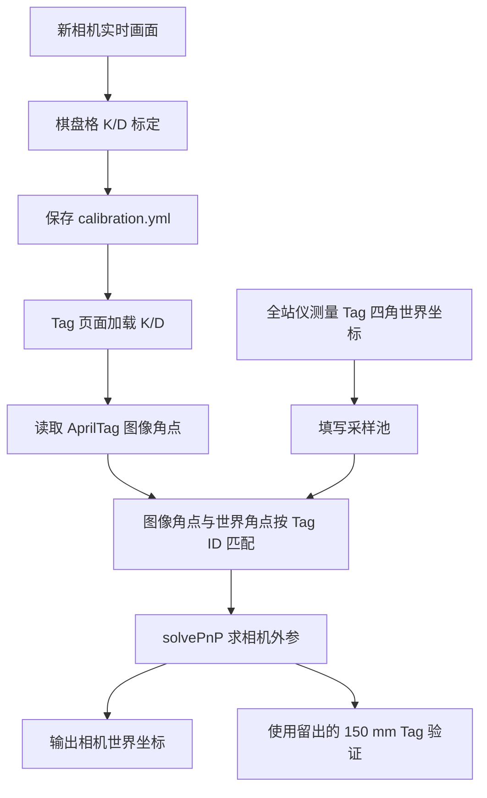
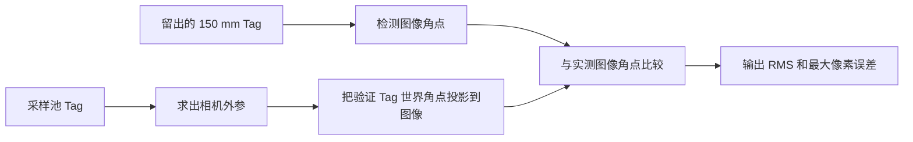

# tag 相机算法

- Session id: `019e8620-4aaa-7dc3-aa52-7cdd68b93523`
- Source cwd: `E:\工作`
- Model provider: `openai`
- Exported at: `2026-06-28T13:13:43`
- Local source: `C:\Users\t250c\.codex\sessions\2026\06\02\rollout-2026-06-02T10-18-43-019e8620-4aaa-7dc3-aa52-7cdd68b93523.jsonl`

## Transcript

### developer 2026-06-02T02:18:46.804Z

```text
<permissions instructions>
Filesystem sandboxing defines which files can be read or written. `sandbox_mode` is `danger-full-access`: No filesystem sandboxing - all commands are permitted. Network access is enabled.
Approval policy is currently never. Do not provide the `sandbox_permissions` for any reason, commands will be rejected.
</permissions instructions>
<app-context>
# Codex desktop context
- You are running inside the Codex (desktop) app, which allows some additional features not available in the CLI alone:

### Images/Visuals/Files
- In the app, the model can display images and videos using standard Markdown image syntax: 
- When sending or referencing a local image or video, always use an absolute filesystem path in the Markdown image tag (e.g., ); relative paths and plain text will not render the media.
- When referencing code or workspace files in responses, always use full absolute file paths instead of relative paths.
- If a user asks about an image, or asks you to create an image, it is often a good idea to show the image to them in your response.
- Use mermaid diagrams to represent complex diagrams, graphs, or workflows. Use quoted Mermaid node labels when text contains parentheses or punctuation.
- Return web URLs as Markdown links (e.g., [label](https://example.com)).

### Workspace Dependencies
- For sheets, slides, and documents, call `load_workspace_dependencies` to find the bundled runtime and libraries.

### Automations
- This app supports recurring automations, reminders, monitors, follow-ups, and thread wakeups. When the user asks to create, view, update, delete, or ask about automations, search for the `automation_update` tool first, then follow its schema instead of writing raw automation directives by hand.

### Thread Coordination
- When the user asks to create, inspect, continue, pin, archive, rename, or otherwise manage Codex threads in the background, search for the relevant thread tool first: `create_thread`, `list_threads`, `read_thread`, `send_message_to_thread`, `set_thread_pinned`, `set_thread_archived`, or `set_thread_title`.

### Inline Code Comments
- Use the ::code-comment{...} directive when you need to attach feedback directly to specific code lines.
- Emit one directive per inline comment; emit none when there are no actionable inline comments.
- Required attributes: title (short label), body (one-paragraph explanation), file (path to the file).
- Optional attributes: start, end (1-based line numbers), priority (0-3).
- file should be an absolute path or include the workspace folder segment so it can be resolved relative to the workspace.
- Keep line ranges tight; end defaults to start.
- Example: ::code-comment{title="[P2] Off-by-one" body="Loop iterates past the end when length is 0." file="/path/to/foo.ts" start=10 end=11 priority=2}

### Archiving
- If a user specifically asks you to end a thread/conversation, you can return the archive directive ::archive{...} to archive the thread/conversation.
- Example: ::archive{reason="User requested to end conversation"}
</app-context>
<collaboration_mode># Collaboration Mode: Default

You are now in Default mode. Any previous instructions for other modes (e.g. Plan mode) are no longer active.

Your active mode changes only when new developer instructions with a different `<collaboration_mode>...</collaboration_mode>` change it; user requests or tool descriptions do not change mode by themselves. Known mode names are Default and Plan.

## request_user_input availability

Use the `request_user_input` tool only when it is listed in the available tools for this turn.

In Default mode, strongly prefer making reasonable assumptions and executing the user's request rather than stopping to ask questions. If you absolutely must ask a question because the answer cannot be discovered from local context and a reasonable assumption would be risky, ask the user directly with a concise plain-text question. Never write a multiple choice question as a textual assistant message.
</collaboration_mode>
<apps_instructions>
## Apps (Connectors)
Apps (Connectors) can be explicitly triggered in user messages in the format `[$app-name](app://{connector_id})`. Apps can also be implicitly triggered as long as the context suggests usage of available apps.
An app is equivalent to a set of MCP tools within the `codex_apps` MCP.
An installed app's MCP tools are either provided to you already, or can be lazy-loaded through the `tool_search` tool. If `tool_search` is available, the apps that are searchable by `tools_search` will be listed by it.
Do not additionally call list_mcp_resources or list_mcp_resource_templates for apps.
</apps_instructions>
<skills_instructions>
## Skills
A skill is a set of local instructions to follow that is stored in a `SKILL.md` file. Below is the list of skills that can be used. Each entry includes a name, description, and file path so you can open the source for full instructions when using a specific skill.
### Available skills
- imagegen: Generate or edit raster images when the task benefits from AI-created bitmap visuals such as photos, illustrations, textures, sprites, mockups, or transparent-background cutouts. Use when Codex should create a brand-new image, transform an existing image, or derive visual variants from references, and the output should be a bitmap asset rather than repo-native code or vector. Do not use when the task is better handled by editing existing SVG/vector/code-native assets, extending an established icon or logo system, or building the visual directly in HTML/CSS/canvas. (file: C:/Users/t250c/.codex/skills/.system/imagegen/SKILL.md)
- openai-docs: Use when the user asks how to build with OpenAI products or APIs and needs up-to-date official documentation with citations, help choosing the latest model for a use case, or model upgrade and prompt-upgrade guidance; prioritize OpenAI docs MCP tools, use bundled references only as helper context, and restrict any fallback browsing to official OpenAI domains. (file: C:/Users/t250c/.codex/skills/.system/openai-docs/SKILL.md)
- plugin-creator: Create and scaffold plugin directories for Codex with a required `.codex-plugin/plugin.json`, optional plugin folders/files, valid manifest defaults, and personal-marketplace entries by default. Use when Codex needs to create a new personal plugin, add optional plugin structure, generate or update marketplace entries for plugin ordering and availability metadata, or update an existing local plugin during development with the CLI-driven cachebuster and reinstall flow. (file: C:/Users/t250c/.codex/skills/.system/plugin-creator/SKILL.md)
- skill-creator: Guide for creating effective skills. This skill should be used when users want to create a new skill (or update an existing skill) that extends Codex's capabilities with specialized knowledge, workflows, or tool integrations. (file: C:/Users/t250c/.codex/skills/.system/skill-creator/SKILL.md)
- skill-installer: Install Codex skills into $CODEX_HOME/skills from a curated list or a GitHub repo path. Use when a user asks to list installable skills, install a curated skill, or install a skill from another repo (including private repos). (file: C:/Users/t250c/.codex/skills/.system/skill-installer/SKILL.md)
- arm-cortex-expert: ARM Cortex-M embedded development guidance for startup, vector table, NVIC, SysTick, low power, DMA, cache coherency, MPU, fault diagnosis, GPIO/peripheral registers, STM32/nRF/SAMD/RP2040-style MCUs, and real-time firmware debugging. (file: C:/Users/t250c/.codex/skills/arm-cortex-expert/SKILL.md)
- browser:control-in-app-browser: Control the in-app Browser. Use to open, navigate, inspect, test, click, type, screenshot, or verify local targets such as localhost, 127.0.0.1, ::1, file://, the current in-app browser tab, and websites shown side by side inside Codex. (file: C:/Users/t250c/.codex/plugins/cache/openai-bundled/browser/26.527.31326/skills/control-in-app-browser/SKILL.md)
- chat-transcript-uploader: Export local Codex chat/session records to timestamped documents and upload them to the user's GitHub toolkit repository. Use for explicit chat transcript/archive requests. For standalone "上传", prefer work-continuity-sync. (file: C:/Users/t250c/.codex/skills/chat-transcript-uploader/SKILL.md)
- documents:documents: Create, edit, redline, and comment on `.docx`, Word, and Google Docs-targeted document artifacts inside the container, with a strict render-and-verify workflow. Use `render_docx.py` to generate page PNGs (and optional PDF) for visual QA, then iterate until layout is flawless before delivering the final document. (file: C:/Users/t250c/.codex/plugins/cache/openai-primary-runtime/documents/26.601.10930/skills/documents/SKILL.md)
- embedded-systems: Use when developing firmware for microcontrollers, implementing RTOS applications, or optimizing power consumption. Invoke for STM32, ESP32, FreeRTOS, bare-metal, power optimization, real-time systems, configure peripherals, write interrupt handlers, implement DMA transfers, debug timing issues. (file: C:/Users/t250c/.codex/skills/embedded-systems/SKILL.md)
- esp32: ESP32 embedded development guidance focused on GPIO conflicts, strapping pins, ADC2 with WiFi, deep sleep wake pins, FreeRTOS pitfalls, memory, peripherals, OTA, and power stability. (file: C:/Users/t250c/.codex/skills/esp32/SKILL.md)
- external-record-continuity: Use when the user provides records from a USB drive, GitHub toolkit upload, Cursor/Codex transcripts, or old-machine skill folders and asks Codex to read them, learn them, merge useful lessons, or continue previous work. (file: C:/Users/t250c/.codex/skills/external-record-continuity/SKILL.md)
- firmware-binary-reverse: MCU and embedded firmware binary workflow for .bin/.hex/.elf/.axf analysis, byte patching, version comparison, checksum/CRC repair, Keil/MDK firmware verification, fixed-address parameter edits, and safe documentation. Use for user-owned firmware images and pair with keil5-embedded-c for source-level work. (file: C:/Users/t250c/.codex/skills/firmware-binary-reverse/SKILL.md)
- github:gh-address-comments: Address actionable GitHub pull request review feedback. Use when the user wants to inspect unresolved review threads, requested changes, or inline review comments on a PR, then implement selected fixes. Use the GitHub app for PR metadata and flat comment reads, and use the bundled GraphQL script via `gh` whenever thread-level state, resolution status, or inline review context matters. (file: C:/Users/t250c/.codex/plugins/cache/openai-curated/github/8770e9d2/skills/gh-address-comments/SKILL.md)
- github:gh-fix-ci: Use when a user asks to debug or fix failing GitHub PR checks that run in GitHub Actions. Use the GitHub app from this plugin for PR metadata and patch context, and use `gh` for Actions check and log inspection before implementing any approved fix. (file: C:/Users/t250c/.codex/plugins/cache/openai-curated/github/8770e9d2/skills/gh-fix-ci/SKILL.md)
- github:github: Triage and orient GitHub repository, pull request, and issue work through the connected GitHub app. Use when the user asks for general GitHub help, wants PR or issue summaries, or needs repository context before choosing a more specific GitHub workflow. (file: C:/Users/t250c/.codex/plugins/cache/openai-curated/github/8770e9d2/skills/github/SKILL.md)
- github:yeet: Publish local changes to GitHub by confirming scope, committing intentionally, pushing the branch, and opening a draft PR through the GitHub app from this plugin, with `gh` used only as a fallback where connector coverage is insufficient. (file: C:/Users/t250c/.codex/plugins/cache/openai-curated/github/8770e9d2/skills/yeet/SKILL.md)
- keil5-embedded-c: Keil5 and embedded C firmware workflow for hardware-related work. Use when Codex works on Keil/uVision projects, C51/ARM/MCU/单片机 code, GBK C files, timers/定时器, interrupts/中断, IO/ADC/PWM/CAN/UART/RS485 protocols/硬件协议, screen/屏端 integration, bin/hex verification, protocol documents/协议文档, or embedded C code changes where correctness depends on real code paths and device behavior. (file: C:/Users/t250c/.codex/skills/keil5-embedded-c/SKILL.md)
- mcu-gpio-peripheral: MCU GPIO and peripheral bring-up workflow for embedded C/Keil/MDK projects. Covers input/output, pullup/pulldown, push-pull/open-drain, alternate functions, EXTI interrupts, debounce, ADC/PWM/UART/I2C/SPI pin conflicts, schematics, register/HAL checks, and Chinese embedded-code conventions. (file: C:/Users/t250c/.codex/skills/mcu-gpio-peripheral/SKILL.md)
- multi-computer-toolkit-merge: Merge Codex toolkit uploads from multiple computers. Use when another computer has its own skills, MCP servers, work-states, memory/sqlite records, or task snapshots that need to be integrated without overwriting local work. (file: C:/Users/t250c/.codex/skills/multi-computer-toolkit-merge/SKILL.md)
- openai-developers:agents-sdk: Build, run, deploy, and evaluate OpenAI Agents SDK apps from Codex. Use when the user asks to create or adapt an Agents SDK app, build from a prompt or Codex thread, prepare a runnable agent prototype, add a focused eval harness, or deploy locally through the Agents SDK Deployment Manager. (file: C:/Users/t250c/.codex/plugins/cache/openai-curated/openai-developers/8770e9d2/skills/agents-sdk/SKILL.md)
- openai-developers:build-chatgpt-app: Build, scaffold, refactor, and troubleshoot ChatGPT Apps SDK applications that combine an MCP server and widget UI. Use when Codex needs to design tools, register UI resources, wire the MCP Apps bridge or ChatGPT compatibility APIs, apply Apps SDK metadata or CSP or domain settings, or produce a docs-aligned project scaffold. Prefer a docs-first workflow by invoking the openai-docs skill or OpenAI developer docs MCP tools before generating code. (file: C:/Users/t250c/.codex/plugins/cache/openai-curated/openai-developers/8770e9d2/skills/build-chatgpt-app/SKILL.md)
- openai-developers:chatgpt-app-submission: Inspect a ChatGPT Apps MCP server codebase and generate chatgpt-app-submission.json with app info suggestions, tool hint justifications, test cases, and negative test cases, then report review-check findings and outputSchema warnings for submission review. (file: C:/Users/t250c/.codex/plugins/cache/openai-curated/openai-developers/8770e9d2/skills/chatgpt-app-submission/SKILL.md)
- openai-developers:openai-api-troubleshooting: Use when an OpenAI API request fails and Codex needs to classify the likely cause, explain the next step, and route to the right follow-up. Covers common runtime failures such as blocked outbound network access, invalid credentials, exhausted API quota or credits, rate limits, and model, project, or organization access issues; delegate key provisioning to openai-platform-api-key and current documentation lookups to openai-docs. (file: C:/Users/t250c/.codex/plugins/cache/openai-curated/openai-developers/8770e9d2/skills/openai-api-troubleshooting/SKILL.md)
- openai-developers:openai-platform-api-key=***REDACTED*** for building, running, testing, debugging, or configuring apps, UIs, scripts, CLIs, generators, and tools that use AI, including AI-powered apps, apps that generate output with AI, and user-input-driven AI features. Treat unspecified AI in build requests as OpenAI API usage unless the user names another provider or says not to use OpenAI. First inspect credentials safely, then ask whether to reuse an existing key or create one before API-dependent implementation. Also use for OPENAI_API_KEY or sk-proj setup requests. Never expose plaintext. (file: C:/Users/t250c/.codex/plugins/cache/openai-curated/openai-developers/8770e9d2/skills/openai-platform-api-key/SKILL.md)
- opencv: OpenCV computer vision library. Use for image processing. (file: C:/Users/t250c/.codex/skills/opencv-g1joshi/SKILL.md)
- opencv: You are an expert in OpenCV (Open Source Computer Vision Library), the most popular library for real-time computer vision. You help developers build image processing pipelines, object detection systems, video analysis tools, augmented reality, and document processing using OpenCV's 2,500+ algorithms for image manipulation, feature detection, camera calibration, 3D reconstruction, and DNN inference — in Python, C++, or JavaScript. (file: C:/Users/t250c/.codex/skills/opencv-terminalskills/SKILL.md)
- pdf: Use when tasks involve reading, creating, or reviewing PDF files where rendering and layout matter; prefer visual checks by rendering pages (Poppler) and use Python tools such as `reportlab`, `pdfplumber`, and `pypdf` for generation and extraction. (file: C:/Users/t250c/.codex/skills/pdf/SKILL.md)
- presentations:Presentations: Build PowerPoint PPTX decks with artifact-tool presentation JSX (file: C:/Users/t250c/.codex/plugins/cache/openai-primary-runtime/presentations/26.601.10930/skills/presentations/SKILL.md)
- radare2: Radare2 reverse-engineering workflow for binary analysis, disassembly, function discovery, strings, cross references, binary diffing, and safe patch planning. Use when analyzing or patching executables, firmware blobs, ELF/PE/Mach-O files, or raw binaries with r2/rabin2/rahash2/radiff2/rasm2. (file: C:/Users/t250c/.codex/skills/radare2/SKILL.md)
- reverse_engineer: Systematic binary reverse engineering toolkit. Extract source code, understand functions, document protocols, compare versions. Uses strings, symbols, disassembly, and differential verification. (file: C:/Users/t250c/.codex/skills/reverse_engineer/SKILL.md)
- security-best-practices: Perform language and framework specific security best-practice reviews and suggest improvements. Trigger only when the user explicitly requests security best practices guidance, a security review/report, or secure-by-default coding help. Trigger only for supported languages (python, javascript/typescript, go). Do not trigger for general code review, debugging, or non-security tasks. (file: C:/Users/t250c/.codex/skills/security-best-practices/SKILL.md)
- security-threat-model: Repository-grounded threat modeling that enumerates trust boundaries, assets, attacker capabilities, abuse paths, and mitigations, and writes a concise Markdown threat model. Trigger only when the user explicitly asks to threat model a codebase or path, enumerate threats/abuse paths, or perform AppSec threat modeling. Do not trigger for general architecture summaries, code review, or non-security design work. (file: C:/Users/t250c/.codex/skills/security-threat-model/SKILL.md)
- senior-computer-vision: Computer vision engineering skill for object detection, image segmentation, and visual AI systems. Covers CNN and Vision Transformer architectures, YOLO/Faster R-CNN/DETR detection, Mask R-CNN/SAM segmentation, and production deployment with ONNX/TensorRT. Includes PyTorch, torchvision, Ultralytics, Detectron2, and MMDetection frameworks. Use when building detection pipelines, training custom models, optimizing inference, or deploying vision systems. (file: C:/Users/t250c/.codex/skills/senior-computer-vision/SKILL.md)
- spreadsheets:Spreadsheets: Use this skill when a user requests to create, modify, analyze, visualize, or work with spreadsheet files (`.xlsx`, `.xls`, `.csv`, `.tsv`) or Google Sheets-targeted spreadsheet artifacts with formulas, formatting, charts, tables, and recalculation. (file: C:/Users/t250c/.codex/plugins/cache/openai-primary-runtime/spreadsheets/26.601.10930/skills/spreadsheets/SKILL.md)
- survey-data-processor: Survey data processing for total-station, GNSS, leveling, point clouds, DTM/TIN generation, coordinate transformation, traverse adjustment, level-loop adjustment, contour generation, and survey deliverables. Use when processing field survey observations, control points, adjusted coordinates, or measurement workbooks. (file: C:/Users/t250c/.codex/skills/survey-data-processor/SKILL.md)
- total-station-calibration: Total station calibration and error-analysis workflow. Use for total-station instrument checks, collimation error, trunnion-axis error, vertical-index error, EDM additive/multiplicative constants, prism constant, atmospheric correction, two-face observations, resection checks, calibration records, and Excel-based calibration calculations. (file: C:/Users/t250c/.codex/skills/total-station-calibration/SKILL.md)
- understand-anything:understand: Analyze a codebase to produce an interactive knowledge graph for understanding architecture, components, and relationships (file: C:/Users/t250c/.understand-anything/repo/understand-anything-plugin/skills/understand/SKILL.md)
- understand-anything:understand-chat: Use when you need to ask questions about a codebase or understand code using a knowledge graph (file: C:/Users/t250c/.understand-anything/repo/understand-anything-plugin/skills/understand-chat/SKILL.md)
- understand-anything:understand-dashboard: Launch the interactive web dashboard to visualize a codebase's knowledge graph (file: C:/Users/t250c/.understand-anything/repo/understand-anything-plugin/skills/understand-dashboard/SKILL.md)
- understand-anything:understand-diff: Use when you need to analyze git diffs or pull requests to understand what changed, affected components, and risks (file: C:/Users/t250c/.understand-anything/repo/understand-anything-plugin/skills/understand-diff/SKILL.md)
- understand-anything:understand-domain: Extract business domain knowledge from a codebase and generate an interactive domain flow graph. Works standalone (lightweight scan) or derives from an existing /understand knowledge graph. (file: C:/Users/t250c/.understand-anything/repo/understand-anything-plugin/skills/understand-domain/SKILL.md)
- understand-anything:understand-explain: Use when you need a deep-dive explanation of a specific file, function, or module in the codebase (file: C:/Users/t250c/.understand-anything/repo/understand-anything-plugin/skills/understand-explain/SKILL.md)
- understand-anything:understand-knowledge: Analyze a Karpathy-pattern LLM wiki knowledge base and generate an interactive knowledge graph with entity extraction, implicit relationships, and topic clustering. (file: C:/Users/t250c/.understand-anything/repo/understand-anything-plugin/skills/understand-knowledge/SKILL.md)
- understand-anything:understand-onboard: Use when you need to generate an onboarding guide for new team members joining a project (file: C:/Users/t250c/.understand-anything/repo/understand-anything-plugin/skills/understand-onboard/SKILL.md)
- work-continuity-sync: Triggered when the user says "上传" as a standalone command or asks for seamless work handoff across computers. Create and upload a complete work-state snapshot including current workspace, session transcript/raw record, skills/MCP/toolkit state, Memory/SQLite records when available, and restore instructions. (file: C:/Users/t250c/.codex/skills/work-continuity-sync/SKILL.md)
- workflow-memory-skillsmith: Mandatory workflow for turning repeated task lessons, tool discoveries, failure fixes, user-specific procedures, and practical troubleshooting records into global Codex skills under ~/.codex/skills. Use after tasks that reveal reusable methods, recurring failure patterns, installation fixes, domain procedures, or user-provided operational notes. (file: C:/Users/t250c/.codex/skills/workflow-memory-skillsmith/SKILL.md)
### How to use skills
- Discovery: The list above is the skills available in this session (name + description + file path). Skill bodies live on disk at the listed paths.
- Trigger rules: If the user names a skill (with `$SkillName` or plain text) OR the task clearly matches a skill's description shown above, you must use that skill for that turn. Multiple mentions mean use them all. Do not carry skills across turns unless re-mentioned.
- Missing/blocked: If a named skill isn't in the list or the path can't be read, say so briefly and continue with the best fallback.
- How to use a skill (progressive disclosure):
  1) After deciding to use a skill, open its `SKILL.md`. Read only enough to follow the workflow.
  2) When `SKILL.md` references relative paths (e.g., `scripts/foo.py`), resolve them relative to the skill directory listed above first, and only consider other paths if needed.
  3) If `SKILL.md` points to extra folders such as `references/`, load only the specific files needed for the request; don't bulk-load everything.
  4) If `scripts/` exist, prefer running or patching them instead of retyping large code blocks.
  5) If `assets/` or templates exist, reuse them instead of recreating from scratch.
- Coordination and sequencing:
  - If multiple skills apply, choose the minimal set that covers the request and state the order you'll use them.
  - Announce which skill(s) you're using and why (one short line). If you skip an obvious skill, say why.
- Context hygiene:
  - Keep context small: summarize long sections instead of pasting them; only load extra files when needed.
  - Avoid deep reference-chasing: prefer opening only files directly linked from `SKILL.md` unless you're blocked.
  - When variants exist (frameworks, providers, domains), pick only the relevant reference file(s) and note that choice.
- Safety and fallback: If a skill can't be applied cleanly (missing files, unclear instructions), state the issue, pick the next-best approach, and continue.
</skills_instructions>
<plugins_instructions>
## Plugins
A plugin is a local bundle of skills, MCP servers, and apps. Below is the list of plugins that are enabled and available in this session.
### Available plugins
- `Browser`: Browser / browser-use plugin Aliases: @browser, @browser-use, browser-use, Browser, in-app browser. Use Browser, the Codex in-app browser, when the user asks to open, inspect, navigate, test, click, type, or screenshot local web targets such as localhost, 127.0.0.1, ::1, file:// URLs, or the current in-app browser tab. After significant frontend changes to a local app, use Browser to open the relevant local target when it is known or obvious, unless the user asks for another browser tool. For requests like "open localhost:3000" or "open to localhost:4000", navigate the in-app browser to http://localhost:3000 or http://localhost:4000. Do not satisfy explicit @browser or @browser-use requests with macOS `open`, shell commands, or generic web browsing unless the user asks for another browser tool or approves a fallback.
- `Documents`: Create and edit document artifacts in Codex, including Word files and Google Docs.
- `GitHub`: Inspect repositories, triage pull requests and issues, debug CI, and publish changes through a hybrid GitHub connector and CLI workflow.
- `OpenAI Developers`: Build with OpenAI APIs, Agents SDK, and ChatGPT Apps, and create and save OpenAI API keys from Codex.
- `Presentations`: Create, edit, render, verify, and export presentation slide decks. Use when Codex needs to build or modify a deck, slidedeck, presentation deck, slide deck, slides, PowerPoint, Google Slides, PPT, PPTX, .ppt, or .pptx file.
- `Spreadsheets`: Create, edit, analyze, visualize, render, and export spreadsheets or Google Sheets-ready workbooks in Codex.
### How to use plugins
- Discovery: The list above is the plugins available in this session.
- Skill naming: If a plugin contributes skills, those skill entries are prefixed with `plugin_name:` in the Skills list.
- Trigger rules: If the user explicitly names a plugin, prefer capabilities associated with that plugin for that turn.
- Relationship to capabilities: Plugins are not invoked directly. Use their underlying skills, MCP tools, and app tools to help solve the task.
- Preference: When a relevant plugin is available, prefer using capabilities associated with that plugin over standalone capabilities that provide similar functionality.
- Missing/blocked: If the user requests a plugin that is not listed above, or the plugin does not have relevant callable capabilities for the task, say so briefly and continue with the best fallback.
</plugins_instructions>
## Memory

You have access to a memory folder with guidance from prior runs. It can save
time and help you stay consistent. Use it whenever it is likely to help.

Decision boundary: should you use memory for a new user query?

- Skip memory ONLY when the request is clearly self-contained and does not need
  workspace history, conventions, or prior decisions.
- Hard skip examples: current time/date, simple translation, simple sentence
  rewrite, one-line shell command, trivial formatting.
- Use memory by default when ANY of these are true:
  - the query mentions workspace/repo/module/path/files in MEMORY_SUMMARY below,
  - the user asks for prior context / consistency / previous decisions,
  - the task is ambiguous and could depend on earlier project choices,
  - the ask is a non-trivial and related to MEMORY_SUMMARY below.
- If unsure, do a quick memory pass.

Memory layout (general -> specific):

- C:\Users\t250c\.codex\memories/memory_summary.md (already provided below; do NOT open again)
- C:\Users\t250c\.codex\memories/MEMORY.md (searchable registry; primary file to query)
- C:\Users\t250c\.codex\memories/skills/<skill-name>/ (skill folder)
  - SKILL.md (entrypoint instructions)
  - scripts/ (optional helper scripts)
  - examples/ (optional example outputs)
  - templates/ (optional templates)
- C:\Users\t250c\.codex\memories/rollout_summaries/ (per-rollout recaps + evidence snippets)
  - The paths of these entries can be found in C:\Users\t250c\.codex\memories/MEMORY.md or C:\Users\t250c\.codex\memories/rollout_summaries/ as `rollout_path`
  - These files are append-only `jsonl`: `session_meta.payload.id` identifies the session, `turn_context` marks turn boundaries, `event_msg` is the lightweight status stream, and `response_item` contains actual messages, tool calls, and tool outputs.
  - For efficient lookup, prefer matching the filename suffix or `session_meta.payload.id`; avoid broad full-content scans unless needed.

Quick memory pass (when applicable):

1. Skim the MEMORY_SUMMARY below and extract task-relevant keywords.
2. Search C:\Users\t250c\.codex\memories/MEMORY.md using those keywords.
3. Only if MEMORY.md directly points to rollout summaries/skills, open the 1-2
   most relevant files under C:\Users\t250c\.codex\memories/rollout_summaries/ or
   C:\Users\t250c\.codex\memories/skills/.
4. If above are not clear and you need exact commands, error text, or precise evidence, search over `rollout_path` for more evidence.
5. If there are no relevant hits, stop memory lookup and continue normally.

Quick-pass budget:

- Keep memory lookup lightweight: ideally <= 4-6 search steps before main work.
- Avoid broad scans of all rollout summaries.

During execution: if you hit repeated errors, confusing behavior, or suspect
relevant prior context, redo the quick memory pass.

How to decide whether to verify memory:

- Consider both risk of drift and verification effort.
- If a fact is likely to drift and is cheap to verify, verify it before
  answering.
- If a fact is likely to drift but verification is expensive, slow, or
  disruptive, it is acceptable to answer from memory in an interactive turn,
  but you should say that it is memory-derived, note that it may be stale, and
  consider offering to refresh it live.
- If a fact is lower-drift and expensive to verify, it is usually fine to
  answer from memory directly.

When answering from memory without current verification:

- If you rely on memory for a fact that you did not verify in the current turn,
  say so briefly in the final answer.
- If that fact is plausibly drift-prone or comes from an older note, older
  snapshot, or prior run summary, say that it may be stale or outdated.
- If live verification was skipped and a refresh would be useful in the
  interactive context, consider offering to verify or refresh it live.
- Do not present unverified memory-derived facts as confirmed-current.
- Prefer a short refresh offer for interactive questions, especially about prior
  results, commands, timing, or older snapshots.

Memory citation requirements:

- If ANY relevant memory files were used: append exactly one
`<oai-mem-citation>` block as the VERY LAST content of the final reply.
  Normal responses should include the answer first, then append the
`<oai-mem-citation>` block at the end.
- Use this exact structure for programmatic parsing:
```
<oai-mem-citation>
<citation_entries>
MEMORY.md:234-236|note=[responsesapi citation extraction code pointer]
rollout_summaries/2026-02-17T21-23-02-LN3m-example.md:10-12|note=[weekly report format]
</citation_entries>
<rollout_ids>
019c6e27-e55b-73d1-87d8-4e01f1f75043
019c7714-3b77-74d1-9866-e1f484aae2ab
</rollout_ids>
</oai-mem-citation>
```
- `citation_entries` is for rendering:
  - one citation entry per line
  - format: `<file>:<line_start>-<line_end>|note=[<how memory was used>]`
  - use file paths relative to the memory base path (for example, `MEMORY.md`,
    `rollout_summaries/...`, `skills/...`)
  - only cite files actually used under the memory base path (do not cite
    workspace files as memory citations)
  - if you used `MEMORY.md` and then a rollout summary/skill file, cite both
  - list entries in order of importance (most important first)
  - `note` should be short, single-line, and use simple characters only (avoid
    unusual symbols, no newlines)
- `rollout_ids` is for us to track what previous rollouts you find useful:
  - include one rollout id per line
  - rollout ids should look like UUIDs (for example,
    `019c6e27-e55b-73d1-87d8-4e01f1f75043`)
  - include unique ids only; do not repeat ids
  - an empty `<rollout_ids>` section is allowed if no rollout ids are available
  - you can find rollout ids in rollout summary files and MEMORY.md
  - do not include file paths or notes in this section
  - For every `citation_entries`, try to find and cite the corresponding rollout id if possible
- Never include memory citations inside pull-request messages.
- Never cite blank lines; double-check ranges.

Updating memories:

You can update the memories **only** when explicitly asked by the user. This must always come from a direct request from the user.
- Write your update in C:\Users\t250c\.codex\memories/extensions/ad_hoc/notes/
- Each update must be one small file containing what you want to add/delete/update from the memories.
- The name of this file must be `<timestamp>-<short slug>.md`
- Do not try to edit the memory files yourself, only add one update note in C:\Users\t250c\.codex\memories/extensions/ad_hoc/notes/

========= MEMORY_SUMMARY BEGINS =========
v1

## User Profile
The user works with Codex on Windows across several recurring lanes: embedded and hardware-oriented C/Keil work, industrial vision/AprilTag calibration, Qt/OpenCV desktop setup in `E:\工作`, and Codex continuity/sync across multiple computers. They expect the agent to recover prior context from local memory, old chat/session artifacts, or their toolkit mirror before asking them to restate background.

They prefer practical, directly usable outputs: working scripts, reusable prompts, ready-to-build scaffolds, concise status summaries, and source-backed verification instead of abstract discussion. They are especially sensitive to weak assumptions in geometry, embedded control logic, and claims about environment state. When they challenge a point, they expect the assistant to trace the real code path, state file, or measurement chain.

Their stable operating constraints are strong: back up before risky edits, preserve GBK/GB2312 when applicable, avoid boundary-drifting edits in embedded C functions, and verify after changes. They also prefer durable reuse: if a workflow repeats, preserve it in memory or skills instead of re-deriving it next time.

## User preferences
- When the user asks to recover memory or prior context, search local Codex memory/session artifacts first, then synced toolkit records, before answering from scratch.
- When the user gives a path-only prompt like `F:\memory`, inspect that path directly instead of asking clarifying questions first.
- When the user says a rule, workflow, or lesson should be remembered globally, persist it into durable memory rather than only summarizing it in chat.
- Infer needed skills proactively from the task, prefer local skills first, then official or trusted GitHub skills; if installation is desired, do it rather than stopping at recommendations.
- Prefer practical fixes over tours: for Codex App or state problems, diagnose the real failure mode and provide the working script/command or repair sequence.
- When the user points to a local installer or driver package, locate it and complete the install plus verification directly instead of turning it into a clarification loop.
- For embedded logic questions, verify against the real code path and distinguish theory from active runtime behavior.
- For geometry or calibration work, justify assumptions with the actual transform chain and world-coordinate validation method before building on them.
- Keep recurring reports brief and structured around completed work, in-progress items, blockers/risks, and next steps.
- Preserve GBK/GB2312 files, back up before sensitive edits, and verify results instead of claiming success from terminal appearance alone.
- For cross-computer continuity, default to merge-not-overwrite and keep device-specific archives separate.

## General Tips
- This environment is Windows with PowerShell; Codex-specific fixes often depend on real local paths under `C:\Users\t250c\.codex`, not just the current workspace.
- If Chinese text looks garbled, retry with UTF-8 or byte-level verification before concluding the file is corrupted.
- System `python`/`py` may be unavailable; the bundled Codex runtime Python under `.cache\codex-runtimes\codex-primary-runtime\dependencies\python\python.exe` is the proven fallback for local tooling.
- For Codex history issues, inspect both `session_index.jsonl` and `.codex-global-state.json`; either can hide history even if raw session files still exist.
- For Windows driver installs, verify signatures, the published `pnputil` driver-store entry, landing files, service, and registry; if hardware is absent, label the result as install-only verification.
- For Qt on this machine, prefer `aqtinstall` over `winget`/MSI retries; `E:\工作\QtSmokeTest\build\QtSmokeTest.exe` is the quick proof that the toolchain works.
- For the AprilTag workflow, validate in world coordinates with held-out tags and total-station measurements; do not trust single-tag `tz` as ground truth at long range.
- For continuity uploads, treat `上传` as full work-state sync unless the user narrows it.

## What's in Memory
### C:\Users\t250c and C:\Users\t250c\Documents\Codex

#### 2026-05-31

- Windows driver installation and device-readiness verification: pnputil, oem137.inf, GC-Tech, USBCANWDM.INF, GCUSBCAN_A64, VID_0C66&PID_000C
  - desc: Search this first for Windows Desktop driver-package installs where the user wants direct install plus proof that the driver actually landed, especially for GC-Tech or USB-CAN hardware in `C:\Users\t250c\Documents\Codex\2026-06-01\new-chat`.
  - learnings: `Driver package added successfully. (Already exists in the system)` can still be a successful result when `pnputil /enum-drivers`, system files, service, and registry all confirm the package is already present; physical hardware still needs a separate PnP check.

- Local Codex memory, skills, MCP, and app/history recovery: programming_handbook_and_discipline.md, keil5-embedded-c, skill_search_preference.md, config.toml, codex_memory_mcp.py, session_index.jsonl, .codex-global-state.json, codex-app-proxy.cmd
  - desc: Search this first for restore-memory flow, local discipline rules, trusted skill installation, custom skill creation, bundled-Python MCP setup, Codex App proxy fixes, and missing-sidebar history repair on this Windows machine.
  - learnings: The durable pattern is discipline-first restore, local-skills-first discovery, bundled Python for MCP tooling, and history repair that fixes both `session_index.jsonl` and `.codex-global-state.json`.

- Fixed-camera AprilTag calibration, mixed tag sizes, and validation: AprilTag, total station, TagCenter_world_calc, ID->TagSize, 150mm, 300mm, Q1 Q2 Q3, K/D
  - desc: Search this first for the user's fixed-camera industrial vision context, the reusable camera prompt, mixed-tag-size handling, and the world-coordinate validation loop.
  - learnings: Measure error in world coordinates, keep some tags out of the solve, treat Q points as optional, and never collapse a mixed-size deployment into one constant `TagSize`.

- Derust-truck historical lookup and cooling-threshold logic: 除锈车, bFan_DI, Hydraulic_Oil_Temp_C, Page19Spare1Pct_retain, Cooling_Motor_DO, Vacuum_Fan_DO, codex-personal-toolkit
  - desc: Search this first when the user asks whether old records or the GitHub mirror already contain derust-truck answers, especially for fan or cooling logic.
  - learnings: Use the toolkit mirror instead of the missing `F:` drive, keep cooling-motor logic separate from vacuum-fan logic, and verify whether retain parameters are scaled before interpreting the displayed value.

### E:\工作 and related embedded checkouts

#### 2026-05-30

- Qt/OpenCV environment setup and template scaffolding: QtOpenCVTemplate, aqtinstall, Qt 6.8.3, QtSmokeTest, cv::imdecode, Unicode path
  - desc: Search this first for the working Qt toolchain paths, unattended install route, and the Qt Widgets plus OpenCV starter project in `E:\工作`.
  - learnings: `aqtinstall` plus a smoke test worked on this machine; avoid the stalled MSI route, and use `QFile` plus `cv::imdecode` for Windows Unicode-path image loading.

- Weekly automation and workspace status reporting: automation_update, weekly status update, QtSmokeTest, QtOpenCVTemplate, aqtinstall.log, no git repository
  - desc: Search this first for the existing recurring status automation and the preferred format for concise weekly workspace summaries in `E:\工作`.
  - learnings: Monday 9:00 AM Asia/Shanghai is the established default cadence, and when Git metadata is absent the report should rely on artifacts, logs, and source inspection.

- Mining charge-car `work_logic` verification: App_usr.c, work_logic, cube_speed_logic, tube_Set_Speed, PWM_ZONE, remaining-height, Paramet_Set7, Paramet_Set8
  - desc: Search this first for source-level verification of whether the embedded charging and withdrawal process matches the user's intended behavior in the `App_usr.c` control path.
  - learnings: The current implementation is theory-speed calculation plus PWM-zone execution with a remaining-height stop, not a true closed-loop "actual charge equals theoretical charge" controller.

### C:\Users\t250c and C:\Users\t250c\Documents\Codex\codex-personal-toolkit

#### 2026-05-31

- Codex continuity, GitHub sync, and cross-computer merge: session_index.jsonl, chat-records, upload-work.ps1, work-states, external-record-continuity, work-continuity-sync, multi-computer-toolkit-merge
  - desc: Search this first for sidebar-chat export, USB/GitHub handoff ingestion, full work-state upload, and merge-not-overwrite behavior across Lenovo and Dell machines.
  - learnings: Keep device archives separate, treat `上传` as work continuity sync, redact secrets before pushing, and run sync locally on the machine that owns the `.codex` data.

### Older Memory Topics

#### C:\Users\t250c\Documents\Codex\2026-05-23\new-chat and external drives

- GBK skill repair and cross-drive write verification: E:\IPMsg\gbk-garbled-comments, SKILL.md, write-ok, utf8-chinese-ok, D-write-ok
  - desc: Use this when a Windows external-drive file needs GBK-safe repair or when the user wants proof that write permissions really work beyond one directory; cwd=C:\Users\t250c\Documents\Codex\2026-05-23\new-chat and target paths on E:\ or D:\.
========= MEMORY_SUMMARY ENDS =========

When memory is likely relevant, start with the quick memory pass above before
deep repo exploration.
```

### user 2026-06-02T02:18:46.804Z

```text
<environment_context>
  <cwd>E:\工作</cwd>
  <shell>powershell</shell>
  <current_date>2026-06-02</current_date>
  <timezone>Asia/Shanghai</timezone>
</environment_context>
```

### user 2026-06-02T02:18:46.808Z

```text
tag 相机算法
```

### assistant 2026-06-02T02:18:51.537Z

```text
我先恢复之前的 Tag 相机标定上下文，确认已有算法链路和验证约束，再直接给你可继续推进的方案。
```

### user 2026-06-02T02:18:53.367Z

```text
E:\AI_划时代\视觉\QtCameraCalibration_codex\QtCameraCalibration  分析下这个。
```

### assistant 2026-06-02T02:19:00.189Z

```text
我会按工业视觉代码审查来做：先读项目结构、入口和标定/Tag 相关实现，再梳理实际数据流、算法假设和风险点。会结合之前固定相机、混合 Tag 尺寸和全站仪世界坐标验证的约束，但以当前源码为准。
```

### assistant 2026-06-02T02:19:11.285Z

```text
当前项目已经包含独立的 `TagPoseWorker`，说明 Tag 位姿链路已进入源码，不只是相机内参标定界面。我接着读核心类和构建配置，重点核对检测器、`solvePnP` 输入、TagSize、坐标系定义以及结果是否真正接到 UI。使用 `opencv` 技能辅助检查 OpenCV 几何实现。
```

### assistant 2026-06-02T02:19:27.704Z

```text
代码主线已经明确：棋盘格标定负责生成 `K/D`，Tag 页用 4 个角点的世界坐标和图像角点做 `solvePnP`，再用单独验证 Tag 做投影误差与独立位姿差。下一步我检查 UI 输入校验、报告输出和当前构建结果，找出“能跑”与“能用于 30 mm 目标验证”之间的差距。
```

### assistant 2026-06-02T02:19:42.108Z

```text
有两个重要结论已经出现：一是源码内确实实现了“采样池 Tag 求相机世界位姿 + 留出 Tag 验证”；二是验证指标目前仍以像素重投影误差和“单 Tag 独立求出的相机位姿差”为主，还没有直接输出你之前要求的世界坐标点误差。现在我补查报告逻辑和编译状态，确认是否还有实现级问题。
```

### assistant 2026-06-02T02:20:13.545Z

```text
编译验证卡在环境变量：当前 PowerShell 找不到 `cmake`，但目录里有历史构建产物。我会继续定位本机 CMake 和检查最新可执行文件时间；同时补读报告尾部，避免把历史 exe 当成当前源码验证结果。
```

### assistant 2026-06-02T02:20:58.362Z

```text
补充确认：刚才部分中文乱码来自 PowerShell 的默认解码方式，不应直接判定源码损坏；`rg` 读取同一行能正常显示中文。我改用 UTF-8 读取，并从 `CMakeCache.txt` 取实际 CMake 路径做构建验证。
```

### assistant 2026-06-02T02:21:15.775Z

```text
我发现一个会直接破坏位姿精度的高优先级问题：程序打开相机时主动设置 `1280x720`，而现有 `calibration.yml` 是 `1920x1080`；加载 K/D 时又没有读取和校验图像尺寸。只要相机实际接受了 1280x720 设置，后续 Tag PnP 就在用错误尺度的内参。接下来我用缓存里的实际 CMake 路径编译，并确认这一点的完整调用链。
```

### assistant 2026-06-02T02:21:32.523Z

```text
缓存记录指向另一台机器的 `C:\\Users\\DELL\\...\\cmake.exe`，本机不存在，因此这里不能重新编译。源码分析已经足够定位主风险；我再检查 VS/MSBuild 是否可直接验证已有解决方案，并整理按优先级的整改顺序。
```

### assistant 2026-06-02T02:22:13.361Z

```text
**结论**
这个项目已经形成可用原型，但还不能直接作为“8 至 12 米距离、世界坐标误差控制在约 30 mm”的验收工具。

当前算法链路是：

```text
棋盘格图像 -> calibrateCamera -> K/D
AprilTag 36h11 多帧检测 -> 角点平均
采样池 Tag 世界角点 + 图像角点 -> solvePnP
-> 相机世界坐标
-> 留出 Tag 重投影验证
```

**已实现**
- 棋盘格标定、自动剔除最差样本：[CalibrationWorker.cpp](E:/AI_划时代/视觉/QtCameraCalibration_codex/QtCameraCalibration/src/CalibrationWorker.cpp:118)
- AprilTag 36h11 检测：[TagPoseWorker.cpp](E:/AI_划时代/视觉/QtCameraCalibration_codex/QtCameraCalibration/src/TagPoseWorker.cpp:56)
- 20 帧采样、至少出现 10 帧、角点抖动不超过 1.5 px：[MainWindow.cpp](E:/AI_划时代/视觉/QtCameraCalibration_codex/QtCameraCalibration/src/MainWindow.cpp:741)
- 每个 Tag 独立填写尺寸和全站仪四角点，支持 300 mm 与 150 mm 混用。
- 采样池 Tag 求外参，150 mm Tag 留出验证：[TagPoseWorker.cpp](E:/AI_划时代/视觉/QtCameraCalibration_codex/QtCameraCalibration/src/TagPoseWorker.cpp:178)

**优先修复**
1. **K/D 分辨率可能不匹配。**  
   程序打开相机时设置为 `1280x720`：[MainWindow.cpp](E:/AI_划时代/视觉/QtCameraCalibration_codex/QtCameraCalibration/src/MainWindow.cpp:378)。  
   现有标定文件是 `1920x1080`：[calibration.yml](E:/AI_划时代/视觉/QtCameraCalibration_codex/QtCameraCalibration/build-msvc/Release/pic/calibration.yml)。  
   加载时只读取 `K/D`，没有校验当前帧尺寸：[TagPoseWorker.cpp](E:/AI_划时代/视觉/QtCameraCalibration_codex/QtCameraCalibration/src/TagPoseWorker.cpp:22)。  
   如果相机接受了 `1280x720` 设置，PnP 位姿会系统性偏差。应读取 YAML 中的宽高，并强制一致或按比例缩放 `fx/fy/cx/cy`。

2. **缺少真正的世界坐标误差。**  
   当前验证输出的是像素 RMS，以及单个验证 Tag 独立解算后的“相机位置差”：[TagPoseWorker.cpp](E:/AI_划时代/视觉/QtCameraCalibration_codex/QtCameraCalibration/src/TagPoseWorker.cpp:215)。  
   单个 150 mm 平面 Tag 在远距离下深度方向不稳定。应增加：
   ```text
   TagCenter_cam
   -> T_world_cam * TagCenter_cam
   -> TagCenter_world_calc
   -> 与全站仪 TagCenter_world_measured 比较
   -> dx, dy, dz, norm_error_mm
   ```
   这才是 30 mm 目标的主要验收指标。

3. **PnP 缺少异常点防护。**  
   当前直接使用 `SOLVEPNP_ITERATIVE`：[TagPoseWorker.cpp](E:/AI_划时代/视觉/QtCameraCalibration_codex/QtCameraCalibration/src/TagPoseWorker.cpp:189)。  
   建议改为 `solvePnPRansac` 初筛，再迭代优化，并输出每个 Tag 的残差。一个角点录入错误不应拖偏全部结果。

4. **角点映射约定需要明确。**  
   UI 用“左上、右上、右下、左下”录入世界点，但几何检查只能确认它们组成正方形：[MainWindow.cpp](E:/AI_划时代/视觉/QtCameraCalibration_codex/QtCameraCalibration/src/MainWindow.cpp:1441)。  
   循环错位、镜像错位仍可能通过检查。应明确“检测器 corner[0..3] 与全站仪点编号”的物理贴标规则，并做方向一致性检查。

5. **Tag 检测精度仍可加强。**  
   当前使用默认 `DetectorParameters`：[TagPoseWorker.cpp](E:/AI_划时代/视觉/QtCameraCalibration_codex/QtCameraCalibration/src/TagPoseWorker.cpp:60)。  
   远距离场景建议启用角点亚像素优化，并记录每个角点的跨帧标准差。

**标定数据检查**
现有 `calibration.yml` 的整体 RMS 为 `0.366 px`，多数单图误差约 `0.10 至 0.34 px`，但有一张达到 `1.960 px`。这张图建议剔除后重新标定，再做边缘区域验证。

**构建状态**
目录中有 2026 年 6 月 1 日生成的 exe，但我没有把当前源码重新编译成功：本机 `cmake` 不在 PATH，缓存还指向另一台电脑的 `C:\Users\DELL\...` 路径。项目目录也不是 Git 仓库。

建议下一步直接改这三项：分辨率强校验、`TagCenter_world_calc` 世界坐标误差输出、`solvePnPRansac` 与逐 Tag 残差报告。
```

### assistant 2026-06-02T02:22:13.364Z

```text
**结论**
这个项目已经形成可用原型，但还不能直接作为“8 至 12 米距离、世界坐标误差控制在约 30 mm”的验收工具。

当前算法链路是：

```text
棋盘格图像 -> calibrateCamera -> K/D
AprilTag 36h11 多帧检测 -> 角点平均
采样池 Tag 世界角点 + 图像角点 -> solvePnP
-> 相机世界坐标
-> 留出 Tag 重投影验证
```

**已实现**
- 棋盘格标定、自动剔除最差样本：[CalibrationWorker.cpp](E:/AI_划时代/视觉/QtCameraCalibration_codex/QtCameraCalibration/src/CalibrationWorker.cpp:118)
- AprilTag 36h11 检测：[TagPoseWorker.cpp](E:/AI_划时代/视觉/QtCameraCalibration_codex/QtCameraCalibration/src/TagPoseWorker.cpp:56)
- 20 帧采样、至少出现 10 帧、角点抖动不超过 1.5 px：[MainWindow.cpp](E:/AI_划时代/视觉/QtCameraCalibration_codex/QtCameraCalibration/src/MainWindow.cpp:741)
- 每个 Tag 独立填写尺寸和全站仪四角点，支持 300 mm 与 150 mm 混用。
- 采样池 Tag 求外参，150 mm Tag 留出验证：[TagPoseWorker.cpp](E:/AI_划时代/视觉/QtCameraCalibration_codex/QtCameraCalibration/src/TagPoseWorker.cpp:178)

**优先修复**
1. **K/D 分辨率可能不匹配。**  
   程序打开相机时设置为 `1280x720`：[MainWindow.cpp](E:/AI_划时代/视觉/QtCameraCalibration_codex/QtCameraCalibration/src/MainWindow.cpp:378)。  
   现有标定文件是 `1920x1080`：[calibration.yml](E:/AI_划时代/视觉/QtCameraCalibration_codex/QtCameraCalibration/build-msvc/Release/pic/calibration.yml)。  
   加载时只读取 `K/D`，没有校验当前帧尺寸：[TagPoseWorker.cpp](E:/AI_划时代/视觉/QtCameraCalibration_codex/QtCameraCalibration/src/TagPoseWorker.cpp:22)。  
   如果相机接受了 `1280x720` 设置，PnP 位姿会系统性偏差。应读取 YAML 中的宽高，并强制一致或按比例缩放 `fx/fy/cx/cy`。

2. **缺少真正的世界坐标误差。**  
   当前验证输出的是像素 RMS，以及单个验证 Tag 独立解算后的“相机位置差”：[TagPoseWorker.cpp](E:/AI_划时代/视觉/QtCameraCalibration_codex/QtCameraCalibration/src/TagPoseWorker.cpp:215)。  
   单个 150 mm 平面 Tag 在远距离下深度方向不稳定。应增加：
   ```text
   TagCenter_cam
   -> T_world_cam * TagCenter_cam
   -> TagCenter_world_calc
   -> 与全站仪 TagCenter_world_measured 比较
   -> dx, dy, dz, norm_error_mm
   ```
   这才是 30 mm 目标的主要验收指标。

3. **PnP 缺少异常点防护。**  
   当前直接使用 `SOLVEPNP_ITERATIVE`：[TagPoseWorker.cpp](E:/AI_划时代/视觉/QtCameraCalibration_codex/QtCameraCalibration/src/TagPoseWorker.cpp:189)。  
   建议改为 `solvePnPRansac` 初筛，再迭代优化，并输出每个 Tag 的残差。一个角点录入错误不应拖偏全部结果。

4. **角点映射约定需要明确。**  
   UI 用“左上、右上、右下、左下”录入世界点，但几何检查只能确认它们组成正方形：[MainWindow.cpp](E:/AI_划时代/视觉/QtCameraCalibration_codex/QtCameraCalibration/src/MainWindow.cpp:1441)。  
   循环错位、镜像错位仍可能通过检查。应明确“检测器 corner[0..3] 与全站仪点编号”的物理贴标规则，并做方向一致性检查。

5. **Tag 检测精度仍可加强。**  
   当前使用默认 `DetectorParameters`：[TagPoseWorker.cpp](E:/AI_划时代/视觉/QtCameraCalibration_codex/QtCameraCalibration/src/TagPoseWorker.cpp:60)。  
   远距离场景建议启用角点亚像素优化，并记录每个角点的跨帧标准差。

**标定数据检查**
现有 `calibration.yml` 的整体 RMS 为 `0.366 px`，多数单图误差约 `0.10 至 0.34 px`，但有一张达到 `1.960 px`。这张图建议剔除后重新标定，再做边缘区域验证。

**构建状态**
目录中有 2026 年 6 月 1 日生成的 exe，但我没有把当前源码重新编译成功：本机 `cmake` 不在 PATH，缓存还指向另一台电脑的 `C:\Users\DELL\...` 路径。项目目录也不是 Git 仓库。

建议下一步直接改这三项：分辨率强校验、`TagCenter_world_calc` 世界坐标误差输出、`solvePnPRansac` 与逐 Tag 残差报告。

<oai-mem-citation>
<citation_entries>
MEMORY.md:176-188|note=[used prior AprilTag accuracy target mixed tag sizes and world-coordinate validation constraints]
</citation_entries>
<rollout_ids>
019e4ba3-3a1f-7dc1-828f-519c1ded6f84
</rollout_ids>
</oai-mem-citation>
```

### user 2026-06-02T02:33:57.107Z

```text
不改，能用吗？
```

### assistant 2026-06-02T02:34:06.220Z

```text
能运行，但不建议直接拿去做正式测量。

必须满足一个前提：Tag 检测画面的实际分辨率必须与 `calibration.yml` 一致，也就是 `1920x1080`。当前程序主动请求 `1280x720`，如果相机接受该设置，位姿结果不可信。

如果暂时不改代码，可以现场这样判断：

1. 打开相机，确认实际画面仍为 `1920x1080`。
2. 用 4 个 300 mm Tag 求姿态。
3. 用未参与求解的 150 mm Tag 做验证。
4. 查看验证 Tag 投影 RMS，尽量控制在 `3 px` 以下。
5. 更换多个位置重复验证，尤其覆盖边缘和远距离位置。

注意：现有软件只能用于初步验证和调试。即使像素 RMS 很小，也不能证明世界坐标误差已经达到 `30 mm`，因为目前没有直接输出全站仪实测世界坐标与算法世界坐标的差值。
```

### user 2026-06-02T02:37:31.784Z

```text
相机我会用同一个相机啊。
```

### assistant 2026-06-02T02:37:37.474Z

```text
同一个相机还不够，还需要使用与标定时相同的：

- 分辨率：`1920x1080`
- 镜头焦距、变焦和对焦状态
- 图像裁剪、缩放方式
- 相机与镜头安装状态

如果运行时变成 `1280x720`，即使是同一个相机，原始 `1920x1080` 的 `K/D` 也不能直接使用。

如果相机驱动忽略程序的 `1280x720` 请求，实际仍输出 `1920x1080`，当前程序可以先用于现场测试。最简单的确认方式是查看相机实际输出帧尺寸，而不是只看相机型号。
```

### user 2026-06-02T02:38:12.826Z

```text
标定的相机和tag使用的相机是同一个相机。
```

### assistant 2026-06-02T02:38:18.100Z

```text
可以用。

因为 K/D 标定和 Tag 检测都由这个程序打开同一台相机，默认都请求 `1280x720`，两阶段实际输出分辨率通常一致。

我之前看到的 `1920x1080 calibration.yml` 是目录中的历史标定文件。只要你现场重新用当前相机标定并加载本次新生成的 `calibration.yml`，不要误用旧文件，就可以直接测试 Tag 算法。

正式使用前仍建议用留出的 150 mm Tag 多位置验证。当前软件能判断稳定性和像素投影误差，但暂时不能直接证明世界坐标误差达到 `30 mm`。
```

### user 2026-06-02T02:39:01.351Z

```text
那个是历史文件， 我会用新的相机去标定内参，然后再加载学习到的yml。
```

### assistant 2026-06-02T02:39:09.988Z

```text
那当前版本可以直接用，不需要先改代码。

按这个顺序操作：

1. 用新相机完成棋盘格标定。
2. 保持相机、镜头、焦距、对焦和分辨率不变。
3. 保存并加载本次生成的 `calibration.yml`。
4. 填写全站仪测得的 Tag 四角世界坐标。
5. 用采样池 Tag 求相机位姿，再用未参与求解的 150 mm Tag 验证。
6. 观察采样池 RMS 和验证 Tag RMS，验证 Tag 尽量低于 `3 px`。

需要明确：软件现阶段适合现场跑通和初步筛选。它输出像素误差及独立位姿差，但没有直接输出目标点世界坐标误差，因此不能仅凭当前报告证明已经达到 `30 mm`。
```

### user 2026-06-02T02:39:32.961Z

```text
另外你把K/D标定 和tag计算的 逻辑展示出来。
```

### assistant 2026-06-02T02:40:03.486Z

```text
**整体流程**


**K/D 标定逻辑**
入口位于 [CalibrationWorker.cpp](E:/AI_划时代/视觉/QtCameraCalibration_codex/QtCameraCalibration/src/CalibrationWorker.cpp:18)。

1. 相机采集图像。
2. 转换成灰度图。
3. 使用 `findChessboardCorners()` 检测棋盘格内角点。
4. 使用 `cornerSubPix()` 做亚像素优化。
5. 多张图像通过位置、面积、倾角、清晰度筛选，避免样本过于相似。
6. 根据棋盘格尺寸生成物方坐标：
   ```cpp
   (x * squareSizeMm, y * squareSizeMm, 0)
   ```
7. 调用：
   ```cpp
   cv::calibrateCamera(...)
   ```
   计算内参矩阵 `K` 和畸变参数 `D`。
8. 使用 `projectPoints()` 计算每张标定图的重投影误差。
9. 保存 `calibration.yml`，包含：
   ```text
   image_width
   image_height
   K
   D
   rms
   per_view_errors
   ```

`K` 的形式：

```text
fx   0   cx
0    fy  cy
0    0   1
```

`D` 保存镜头畸变参数。

**Tag 检测逻辑**
入口位于 [TagPoseWorker.cpp](E:/AI_划时代/视觉/QtCameraCalibration_codex/QtCameraCalibration/src/TagPoseWorker.cpp:43)。

1. 将当前相机画面转为灰度图。
2. 使用 OpenCV 的：
   ```cpp
   cv::aruco::DICT_APRILTAG_36h11
   ```
3. 检测每个 Tag 的：
   ```text
   Tag ID
   左上、右上、右下、左下 4 个图像角点
   ```
4. 连续采集 20 帧。
5. Tag 至少需要出现 10 帧。
6. 对每个角点取多帧平均值。
7. 最大角点抖动超过 `1.5 px` 的 Tag 会被丢弃。

对应代码：[MainWindow.cpp](E:/AI_划时代/视觉/QtCameraCalibration_codex/QtCameraCalibration/src/MainWindow.cpp:741)。

**Tag 外参计算逻辑**
入口位于 [TagPoseWorker.cpp](E:/AI_划时代/视觉/QtCameraCalibration_codex/QtCameraCalibration/src/TagPoseWorker.cpp:154)。

采样池中的每个 Tag 需要输入全站仪测得的四角世界坐标：

```text
左上  X Y Z
右上  X Y Z
右下  X Y Z
左下  X Y Z
```

程序根据 Tag ID 将两类数据配对：

```text
全站仪测量的世界角点 Point3f
AprilTag 检测的图像角点 Point2f
```

然后调用：

```cpp
cv::solvePnP(
    objectPoints,
    imagePoints,
    K,
    D,
    rvecCamWorld,
    tvecCamWorld,
    false,
    cv::SOLVEPNP_ITERATIVE
);
```

其数学关系为：

```text
P_cam = R_cam_world * P_world + t_cam_world
```

程序再求逆变换：

```text
R_world_cam = R_cam_world^T
t_world_cam = -R_world_cam * t_cam_world
```

得到相机在全站仪世界坐标系中的位置。

**验证逻辑**
当前 150 mm Tag 不参与外参求解，只用于独立验证：



程序还会单独使用该 150 mm Tag 解算一次相机位姿，再与采样池结果比较：

```text
独立姿态平移差 mm
独立姿态角度差 deg
```

对应代码：[TagPoseWorker.cpp](E:/AI_划时代/视觉/QtCameraCalibration_codex/QtCameraCalibration/src/TagPoseWorker.cpp:203)。

**尺寸字段说明**
`size_mm` 当前用于检查全站仪录入的四角坐标是否构成正确尺寸的正方形：[MainWindow.cpp](E:/AI_划时代/视觉/QtCameraCalibration_codex/QtCameraCalibration/src/MainWindow.cpp:1447)。

真正进入 `solvePnP()` 的是全站仪测得的四角世界坐标。因此 300 mm 和 150 mm Tag 可以混合使用，只要每个 Tag 的 ID、尺寸和四角坐标填写正确。
```

### assistant 2026-06-02T02:40:03.490Z

```text
**整体流程**


**K/D 标定逻辑**
入口位于 [CalibrationWorker.cpp](E:/AI_划时代/视觉/QtCameraCalibration_codex/QtCameraCalibration/src/CalibrationWorker.cpp:18)。

1. 相机采集图像。
2. 转换成灰度图。
3. 使用 `findChessboardCorners()` 检测棋盘格内角点。
4. 使用 `cornerSubPix()` 做亚像素优化。
5. 多张图像通过位置、面积、倾角、清晰度筛选，避免样本过于相似。
6. 根据棋盘格尺寸生成物方坐标：
   ```cpp
   (x * squareSizeMm, y * squareSizeMm, 0)
   ```
7. 调用：
   ```cpp
   cv::calibrateCamera(...)
   ```
   计算内参矩阵 `K` 和畸变参数 `D`。
8. 使用 `projectPoints()` 计算每张标定图的重投影误差。
9. 保存 `calibration.yml`，包含：
   ```text
   image_width
   image_height
   K
   D
   rms
   per_view_errors
   ```

`K` 的形式：

```text
fx   0   cx
0    fy  cy
0    0   1
```

`D` 保存镜头畸变参数。

**Tag 检测逻辑**
入口位于 [TagPoseWorker.cpp](E:/AI_划时代/视觉/QtCameraCalibration_codex/QtCameraCalibration/src/TagPoseWorker.cpp:43)。

1. 将当前相机画面转为灰度图。
2. 使用 OpenCV 的：
   ```cpp
   cv::aruco::DICT_APRILTAG_36h11
   ```
3. 检测每个 Tag 的：
   ```text
   Tag ID
   左上、右上、右下、左下 4 个图像角点
   ```
4. 连续采集 20 帧。
5. Tag 至少需要出现 10 帧。
6. 对每个角点取多帧平均值。
7. 最大角点抖动超过 `1.5 px` 的 Tag 会被丢弃。

对应代码：[MainWindow.cpp](E:/AI_划时代/视觉/QtCameraCalibration_codex/QtCameraCalibration/src/MainWindow.cpp:741)。

**Tag 外参计算逻辑**
入口位于 [TagPoseWorker.cpp](E:/AI_划时代/视觉/QtCameraCalibration_codex/QtCameraCalibration/src/TagPoseWorker.cpp:154)。

采样池中的每个 Tag 需要输入全站仪测得的四角世界坐标：

```text
左上  X Y Z
右上  X Y Z
右下  X Y Z
左下  X Y Z
```

程序根据 Tag ID 将两类数据配对：

```text
全站仪测量的世界角点 Point3f
AprilTag 检测的图像角点 Point2f
```

然后调用：

```cpp
cv::solvePnP(
    objectPoints,
    imagePoints,
    K,
    D,
    rvecCamWorld,
    tvecCamWorld,
    false,
    cv::SOLVEPNP_ITERATIVE
);
```

其数学关系为：

```text
P_cam = R_cam_world * P_world + t_cam_world
```

程序再求逆变换：

```text
R_world_cam = R_cam_world^T
t_world_cam = -R_world_cam * t_cam_world
```

得到相机在全站仪世界坐标系中的位置。

**验证逻辑**
当前 150 mm Tag 不参与外参求解，只用于独立验证：


程序还会单独使用该 150 mm Tag 解算一次相机位姿，再与采样池结果比较：

```text
独立姿态平移差 mm
独立姿态角度差 deg
```

对应代码：[TagPoseWorker.cpp](E:/AI_划时代/视觉/QtCameraCalibration_codex/QtCameraCalibration/src/TagPoseWorker.cpp:203)。

**尺寸字段说明**
`size_mm` 当前用于检查全站仪录入的四角坐标是否构成正确尺寸的正方形：[MainWindow.cpp](E:/AI_划时代/视觉/QtCameraCalibration_codex/QtCameraCalibration/src/MainWindow.cpp:1447)。

真正进入 `solvePnP()` 的是全站仪测得的四角世界坐标。因此 300 mm 和 150 mm Tag 可以混合使用，只要每个 Tag 的 ID、尺寸和四角坐标填写正确。

<oai-mem-citation>
<citation_entries>
MEMORY.md:176-188|note=[used prior mixed tag sizes and held-out world-coordinate validation context]
</citation_entries>
<rollout_ids>
019e4ba3-3a1f-7dc1-828f-519c1ded6f84
</rollout_ids>
</oai-mem-citation>
```

### user 2026-06-02T02:42:33.738Z

```text
你按这个 来形成一个html
```

### assistant 2026-06-02T02:42:40.320Z

```text
我会把刚才的算法说明整理成一个可直接打开的单页 HTML，包含流程图、公式、操作顺序和源码位置。先确认目标目录内容，再生成文件并检查页面结构。
```

### assistant 2026-06-02T02:42:43.041Z

```text
目标目录中还没有同名说明文件。我现在新增 `tag_camera_algorithm.html`，页面使用纯 HTML/CSS，不依赖外网，双击即可查看。
```

### assistant 2026-06-02T02:44:09.512Z

```text
HTML 已生成。我现在做一次本地结构检查，确认中文编码、标题、关键章节和标签闭合没有问题。
```

### assistant 2026-06-02T02:44:19.133Z

```text
已生成 HTML：

[tag_camera_algorithm.html](E:/AI_划时代/视觉/QtCameraCalibration_codex/QtCameraCalibration/tag_camera_algorithm.html)

包含整体流程、K/D 标定、Tag 多帧检测、`solvePnP` 外参计算、坐标变换、留出验证、混合尺寸说明和现场操作步骤。

已检查 UTF-8 编码、8 个章节和 HTML 标签闭合。双击文件即可离线打开。
```

### user 2026-06-02T03:44:21.225Z

```text
我先看看
```

### assistant 2026-06-02T03:44:29.328Z

```text
可以，先看这个文件：

[tag_camera_algorithm.html](E:/AI_划时代/视觉/QtCameraCalibration_codex/QtCameraCalibration/tag_camera_algorithm.html)

看完你觉得哪里表述不对、太复杂、或者要改成给现场人员看的版本，我再按你的反馈调整。
```

### user 2026-06-02T05:27:08.110Z

```text
能做一个软件使用步骤吗？
```

### assistant 2026-06-02T05:27:17.864Z

```text
可以。我会按当前软件界面做一个“现场使用步骤”文档，重点写操作顺序、每一步看什么状态、什么情况不能继续。先抓一下界面按钮和标签文字，避免步骤名称和软件不一致。
```

### assistant 2026-06-02T05:27:21.371Z

```text
界面名称已经对上了：软件分为 `K/D 内参标定` 和 `Tag 姿态验证` 两页。我现在生成一个独立的使用步骤 HTML，按“先标定、再加载 YAML、再测 Tag、最后验证保存”的现场顺序写。
```

### assistant 2026-06-02T05:28:55.334Z

```text
使用步骤 HTML 已生成。我现在做一次结构检查，确认标题、章节和关键按钮文字都在文件里。
```

### assistant 2026-06-02T05:29:06.134Z

```text
已做好软件使用步骤 HTML：

[software_usage_steps.html](E:/AI_划时代/视觉/QtCameraCalibration_codex/QtCameraCalibration/software_usage_steps.html)

内容按现场操作顺序写了：准备工作、K/D 标定、保存 YAML、全站仪测 Tag 坐标、Tag 姿态验证、结果判断、常见问题和现场记录建议。

也已检查 UTF-8、8 个章节、关键按钮文字和 HTML 标签闭合。
```
